```{r setup, include=FALSE}
options(htmltools.dir.version = FALSE)
knitr::opts_chunk$set(
  eval = TRUE,
  message = FALSE,
  echo = TRUE,
  warnings = TRUE,
  fig.align = "center"
)

fig.count <- 0
table.count <- 1
```


```{r setup2, include=FALSE}
# library(readr)
library("ggplot2")
# library("GGally")
library("dplyr")
library("knitr")
library("kableExtra")

# library("DESeq2")
# library("airway")
# library("ade4")

```

# Topics

* Curse of dimensionality - or a blessing in disguise?

* Multiple testing

* Linear model selection and regularization or 
How to obtain parsimonious statistical models

* How to extract essential information from data: PCA


---
class: inverse, center, middle

# Linear model selection and regularization or How to obtain parsimonious statistical models
---

# Outline

- Based on Chapters 3 and 6, ISLR

## Multiple linear regression

## Subset Selection
- Best Subset Selection
- Stepwise Selection (Forward, Backward, Hybrid)
- Chossing Optimal Model
  
## Shrinkage
- Ridge Regression
- The Lasso
- Selecting Turning Parameter 

---
# Linear regression
* Linear regression is commonly used to describe the relationship between

  + a quantitative response $Y$ and
  
  + a set of predictor variables $X_1, X_2, \ldots, X_p$
  
* Model is written as  
$Y = \beta_0 + \beta_1  X_1 + \beta_2 X_2 + \cdots + \beta_p X_p + \varepsilon$  
where $\varepsilon$ is usually assumed to be a normally distributed error: $\varepsilon \sim \mathcal{N}(0, 1)$

* Standard method to determine regression coefficients $\beta_1 , \beta_2, \ldots, \beta_p$ 
by minimizing least squares criterion, i. e. the squared residuals  
$\sum_{i=1}^{n}{(y_i - \beta_0 - \beta_1 x_1 - \beta_2 x_2 - \cdots - \beta_p x_p)^2}$  
where $n =$ number of observations

* Least squares estimates $\hat{\beta_1} , \hat{\beta_2}, \ldots, \hat{\beta_p}$
are unbiased if the model is specified correctly

---
# Evaluating a linear regression model
## 1. Is there any relationship between response and predictors?

Test the null hypothesis $H_0: \beta_1 = \beta_2 = \cdots = \beta_p = 0$

versus the alternative $H_1: \beta_j \ne 0$ for at least one $j \epsilon \{1, \ldots, p\}$

by computing the F-statistic

$F = \frac{(\sum_{i=1}^{n}(y_i - \bar{y})^2 - \sum_{i=1}^{n}(y_i - \hat{y_i})^2)/p}{\sum_{i=1}^{n}(y_i - \hat{y_i})^2/(n - p -1)}$  

where 

* $\hat{y_i} = \hat{\beta_0} + \hat{\beta_1} x_1 + \hat{\beta_2} x_2 \cdots + \hat{\beta_p} x_p$  
* $\sum_{i=1}^{n}(y_i - \bar{y})^2 =$ total sum of squares (about the mean)  
*  $\sum_{i=1}^{n}(y_i - \hat{y_i})^2 =$ residual sum of squares (RSS)
---

# Evaluating a linear regression model
## 2. How well does the model fit the data
### Common measures for model fit
* Explained variance $R^2 = \frac{\sum_{i=1}^{n}(y_i - \hat{y_i})^2}{\sum_{i=1}^{n}(y_i - \bar{y})^2 }$
  + $R^2$ close to 1 indicates that large proportion of variance ist explained by model
  + increases when variables are added
  
* Residual standard error $RSE = \sqrt{\frac{1}{n-p-1} \sum_{i=1}^{n}(y_i - \hat{y_i})^2}$
  + decreases when variables are added that substantially reduce RSS
  + may increase when decrease due to addes variable is small compared to decrease in numerator
  
* Other criteria , e. g. AIC, BIC, ... (more details)
---

# Evaluating a linear regression model
## 3. Are all predictors necesessary?
### Forward stepwise selection
* Begins with a model containing no predictors
* Adds the predictor that gives the greatest improvement to the model
* Adds further predictors until all predictors are added
* Of all models created, the “best” is chosen

### Backward stepwise selection
* A model is built including all predictors
* At each step, the least-predictive is removed
* Of each of the models produced by each step, the best model is selected
* Cannot be used when n < p
---

# Linear model selection and regularization 
## Motivation
### Improve Accuracy
- Least-squares is ideal where $n>>p$
- Not as good if $n>p$
- Linear equations cannot be solved if $n<<p$

### Improve Interpretability
 - Remove irrelevant predictors
---

# Subset Selection: Best Subset Selection 

- Try all possible combinations of $p$ predictors and choose the best one


- Advantages: Exhaustive & simple


- Disadvantages: Computationally intensive 

  - $2^p$ possible models must be evaluated
  
  - "becomes computationally infeasible for values of $p$ greater than around 40" 

---


# Subset Selection: Best Subset Selection 

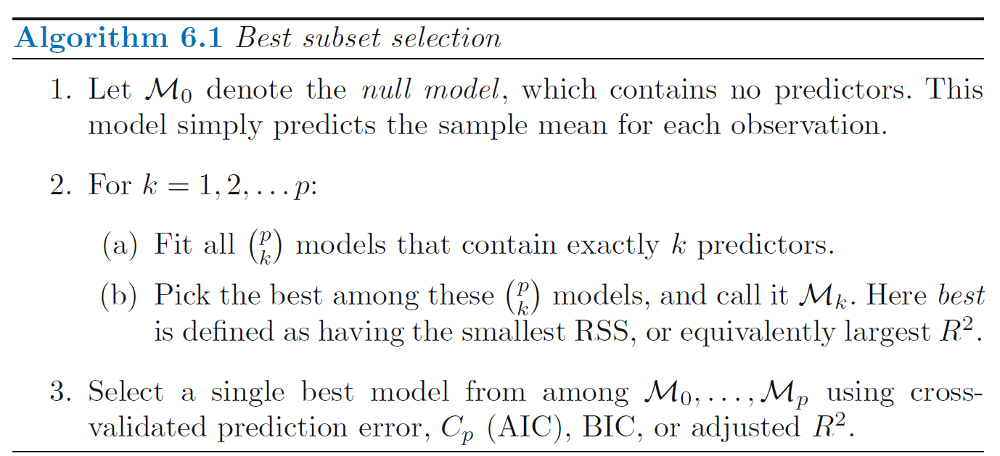


---


# Subset Selection: Best Subset Selection 

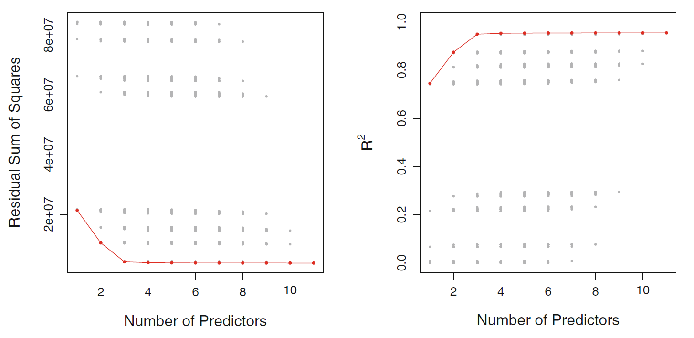

Each possible model with all predictors of `Credit` data set. Red frontier tracks the best model for a given number of predictors, according to $RSS$ and $R^2$

---


# Subset Selection: Stepwise Selection 

Stepwise methods explore a more restricted set of  models, reducing overfitting and reducing time to select/fit the model.


Three types: 

- Forward Stepwise

- Backward Stepwise

- Hybrid Approaches

---


# Subset Selection: Stepwise Selection 
## Forward Stepwise 
- Begins with a model containing no predictors
- Adds the predictor that gives the greatest improvement to the model
- Adds further predictors until all predictors are added
- Of all models created, the “best” is chosen
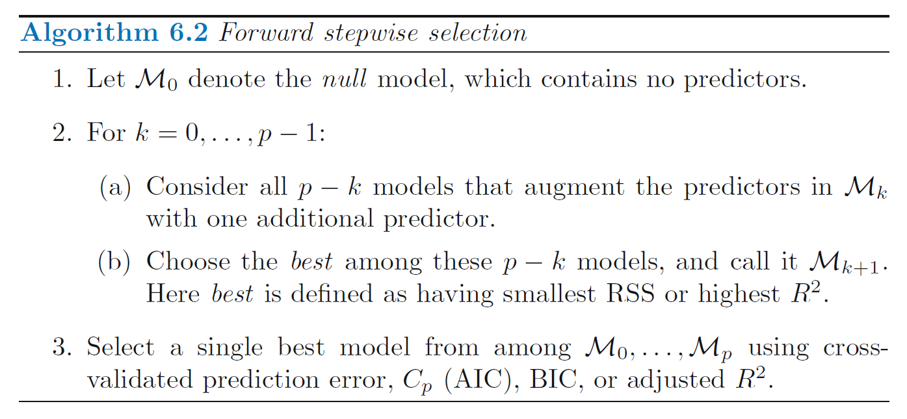


---

# Subset Selection: Stepwise Selection 
## Backward Stepwise 
- A model is built including all predictors
- At each step, the least-predictive is removed 
- Of each of the models produced by each step, the best model is selected
- Cannot be used when $n < p$
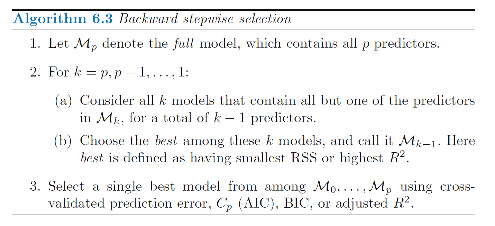


---

# Subset Selection: Stepwise Selection 
## Hybrid approaches

- Hybrid combine both forward and backward selection.

- These models begin with a null model and add predictors like forward selection.

- At each step, they also remove predictors that are less-informative, like backward selection. 


---


# Stepwise Selection vs Best Subset Selection

### Stepwise Selection:
- Faster than best subset selection
- Tractable for problems with $p > 40$


### Best Subset Selection
- Guaranteed to find the best possible model

---


# Subset Selection: Optimal Model 

“The model containing all of the predictors will always have the smallest $RSS$ and the
largest $R^2$, since these quantities are related to the training error.”


We wish to choose a model with a low test error.


### Estimating test error:

- Adjust the training error to account for bias

- Directly estimate with cross-validation or a validation set

---

# Subset Selection: Optimal Model
 ## Adjusting with $C_p$ 

<center>
 $C_p = \frac{1}{n}\left ( RSS + 2d \hat{\sigma}^2 \right)$
</center>
$~$
- For least-squares models with $d$ predictors

- An unbiased estimate of MSE, if $\hat{\sigma}^2$ is an unbiased estimate of $\sigma^2$

- The penalty increases as the number of predictors in the model increases

- Choose the model with the lowest $C_p$ value


---

# Subset Selection: Optimal Model
 ## Adjusting with Akaike Information Criterion $AIC$
<center>
$AIC = \frac{1}{n\hat{\sigma}^2}\left ( RSS + 2d \hat{\sigma}^2 \right)$
</center>
$~$
- For models fit with maximum likelihood

- Omitted a constant: Proportional to $C_p$

---

# Subset Selection: Optimal Model
 ## Adjusting with Bayesian Information Criterion $BIC$
<center>
$BIC = \frac{1}{n\hat{\sigma}^2}\left ( RSS + log(n)d\hat{\sigma}^2 \right)$
</center>
$~$
- For models fit with maximum likelihood 

- Omitted an additive constant

- Heavier penalty on the number of predictors than $C_p$

---

# Subset Selection: Optimal Model
 ## Adjusting with Adjusted $R^2$
<center>
$Adjusted R^2 = 1 - \frac{RSS/(n-d-1)}{TSS/(n-1)}$

$TSS = \sum (y_i − \bar{y})^2$
</center>
$~$
- Regular $R^2$ always increases with added predictors.

- The Adjusted $R^2$, is corrected for the number of predictors $d$, such that it may decrease as additional, less-informative predictors are added to the model. 

- A large value of Adjusted $R^2$ indicates a model with low test error.


---
# Subset Selection: Optimal Model
 ## Comparison: $C_p$ vs $BIC$ vs $R^2$

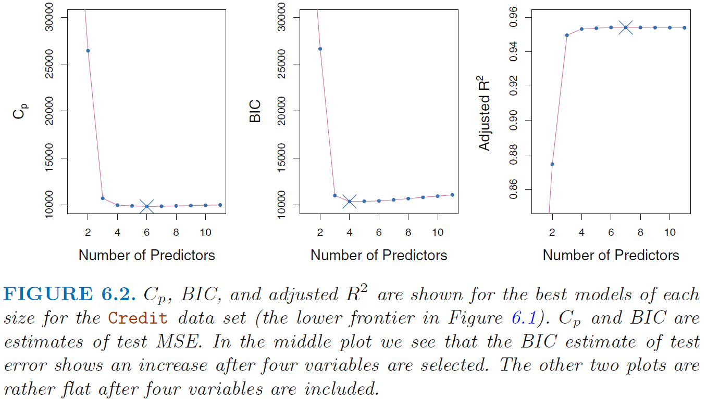

---
# Subset Selection: Optimal Model
 ## Estimating with Validation or Cross-Validation 

- Compute validation set error or cross-validation error for each model

- Select model with smallest test error 

- Directly estimated test error based on fewer assumptions


---

# Subset Selection: Optimal Model
 ## Comparison: Adjusting vs Estimating

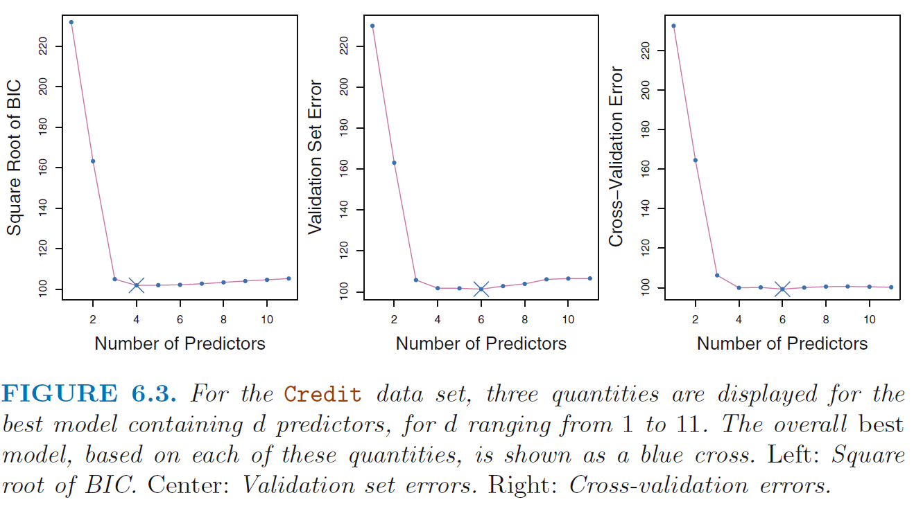

---

# Subset Selection: Optimal Model
 ## one-standard-error-rule

- Calculate the standard error of test MSE for each model.
Select the smallest model for which the estimated test error is within one SE of the lowest point in the curve. 

" The rationale here is that
if a set of models appear to be more or less equally good, then we might
as well choose the simplest model—that is, the model with the smallest
number of predictors. "


---

# Shrinkage methods

- Fit a model with all predictors that shrinks coefficient estimates towards zero

- Shrinking coefficient estimates can significantly reduce their variance

- Two best known shrinkage methods: ridge and lasso

- For both, ridge and lasso, predictors should be standardized, i.e.
  + substract mean
  + divide by variance


---


# Shrinkage methods: Ridge

- Very similar to least squares in that both methods select coefficients that reduce RSS

- Coefficients are estimated by minimizing slightly different quantity 

 
$~$
$~$
<center>

$\sum_{i=1}^{n}\left (y_i - \beta_0 - \sum_{j=1}^{p} \beta_j x_{ij}  \right )^2 + \lambda \sum_{j=1}^{p} \beta_j^2 = RSS + \lambda \sum_{j=1}^{p} \beta_j^2$


---

# Shrinkage methods: Ridge

<center>

$RSS + \lambda \sum_{j=1}^{p} \beta_j^2$ 

</center> 

### Shrinkage penalty
- Is small when coefficients close to zero
- Has the effect of shrinking $β_j$ toward zero
- Only applied to coefficients, not to the intercept

### Tuning parameter
- Controls impact of shrinkage penalty
- When $\lambda = 0$: Same results as least squares
- As $\lambda \rightarrow \infty$, coefficients approach zero
- Ridge offers a different set of coefficients for each value of $\lambda$
- Selecting a good value for $\lambda$ is critical

---


# Shrinkage methods: Ridge

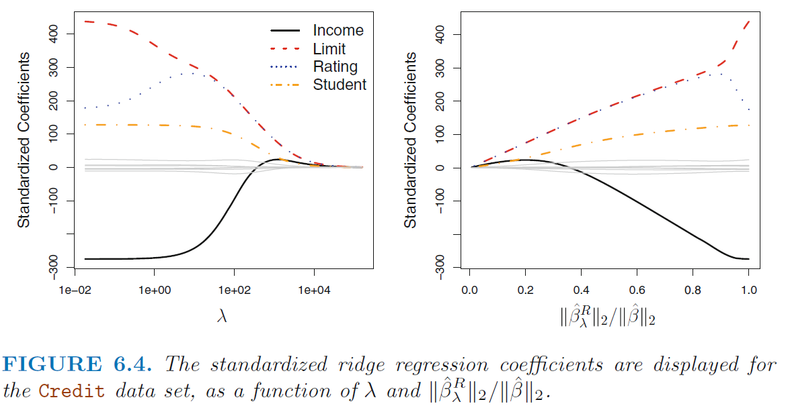

---

# Shrinkage methods: Ridge

- Unlike least squares, ridge is very scale dependent

- Therefore must standardize coefficients

- The following formula will ensure all coefficients have a standard deviation of one

$~$
$~$

<center>
$\tilde{x}_{i j} = \frac{x_{i j}}{\sqrt{\frac{1}{n} \sum_{i=1}^{n}\left(x_{i j}-\bar{x}_{j}\right)^{2}}}$

---

# Shrinkage methods: Ridge
- Advantage of ridge is rooted in the bias-variance trade-off
- As $\lambda$ increases, bias increases, but variance decreases

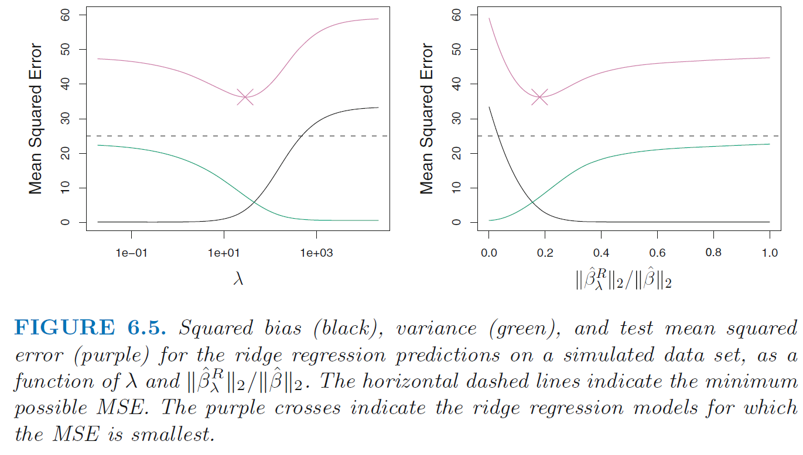

---


# Shrinkage methods: The Lasso

- Similar to Ridge, but with $|\beta_j|$, which forces some coefficients to be zero: Performs variable selection

- Creates models that are easier to interpret

- Shrinks coefficient estimates towards zero

$~$
$~$

<center>
$\sum_{i=1}^{n}\left(y_{i}-\beta_{0}-\sum_{j=1}^{p} \beta_{j} x_{i j}\right)^{2}+\lambda \sum_{j=1}^{p}\left|\beta_{j}\right|=\mathrm{RSS}+\lambda \sum_{j=1}^{p}\left|\beta_{j}\right|$


---

# Shrinkage methods: The Lasso

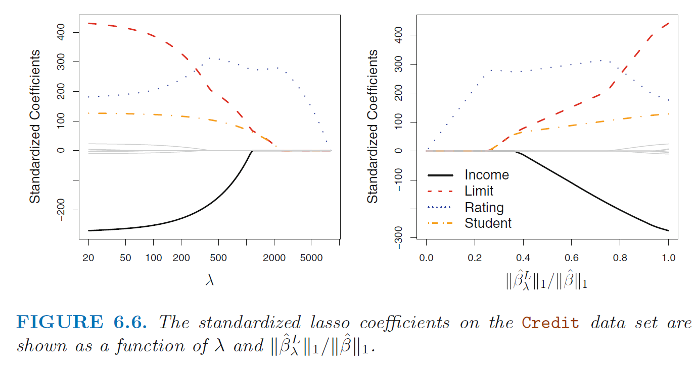

---


# Shrinkage methods: Alternative Formulation

### Ridge

<center>
$\underset{\beta}{\operatorname{minimize}}\left\{\sum_{i=1}^{n}\left(y_{i}-\beta_{0}-\sum_{j=1}^{p} \beta_{j} x_{i j}\right)^{2}\right\} \quad \text { subject to } \quad \sum_{j=1}^{p} \beta_{j}^{2} \leq s$
</center>

### Lasso

<center>
$\underset{\beta}{\operatorname{minimize}}\left\{\sum_{i=1}^{n}\left(y_{i}-\beta_{0}-\sum_{j=1}^{p} \beta_{j} x_{i j}\right)^{2}\right\} \quad \text { subject to } \quad \sum_{j=1}^{p}\left|\beta_{j}\right| \leq s$
</center>

- We are trying to find the set of estimates that lead to the smallest $RSS$, subject to the constraint that there is a budget $s$ 

- If $s$ is very large, it yields least squares solution


---

# Shrinkage methods: Graphical intuition

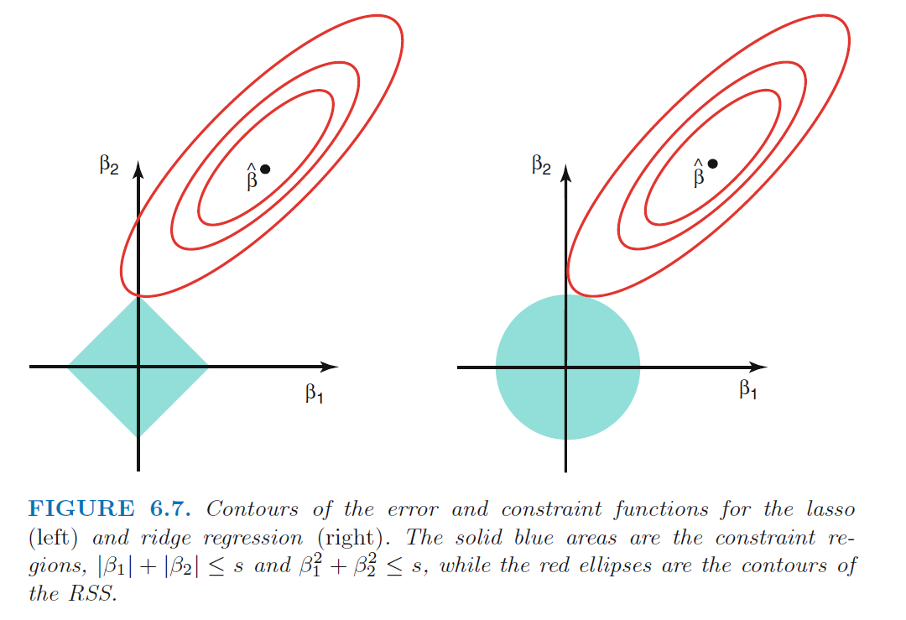

---

# Shrinkage methods: Ridge vs Lasso

- Qualitatively, both give very similar results.
For both, as $\lambda$ increases, variance decreases and bias increases

- If all predictors associated with outcome, ridge slightly outperforms lasso

- When not all predictors associated with outcome or when some predictors have very large coefficients, lasso slightly outperforms ridge

- Ridge regression more or less shrinks every dimension of the data by the same proportion, whereas the lasso more or less shrinks all coefficients toward or to zero by a similar amount

- Biggest advantage of lasso is variable selection, making model interpretation easier

- Use cross-validation to determine which technique is better for a particular dataset


---

# Shrinkage methods: Bayesian point of view 

- In Bayesian theory, we assume $\beta$ has a prior distribution: $p(\beta)$ Multiplying that prior by the likelihood gives us the posterior distribution. 

- If $p(\beta)$ follows a Gaussian distribution with mean 0 and SD that is a function of $\lambda$ then the most likely posterior value for $\beta$ is the ridge regression solution

- If $p(\beta)$ follows a Laplace distribution with mean 0 and a scale parameter of $\lambda$ then the most likely posterior value for $\beta$ is the lasso regression solution


---


# Shrinkage methods: Selecting $\lambda$

- Cross validation is a simple way to choose the best $\lambda$

 - Choose a grid of $\lambda$ values and compute cross-validation error for each value of $\lambda$
 - Choose $\lambda$ for which error is smallest

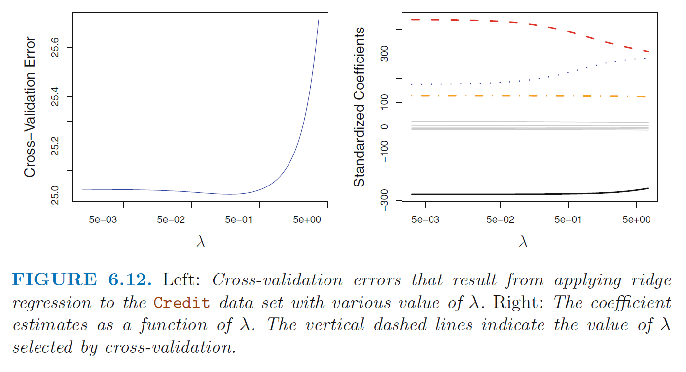


---
# References
* Susan Holmes, Wolfgang Huber. Modern Statistics for Modern Biology. Cambridge University Press, 2019. The book is also online: https://www.huber.embl.de/msmb/

* Gareth James, Daniela Witten, Trevor Hastie, Robert Tibshirani. An Introduction to Statistical Learning. Second edition. Springer New York, 2021. PDF (legally) available at https://hastie.su.domains/ISLR2/ISLRv2_website.pdf

* Trevor Hastie, Robert Tibshirani. The Elements of Statistical Learning. pringer New York, 2009 PDF (legally) available at https://web.stanford.edu/~hastie/ElemStatLearn/printings/ESLII_print12_toc.pdf

* Frank E. Harrell. Regression Modeling Strategies. Second edition. Springer Cham 2015.

* https://en.wikipedia.org/wiki/Statistical_hypothesis_testing (especially for a comparison between Fisherian, frequentist (Neyman–Pearson) interpretation)

* https://xkcd.com/882/
