```{r setup, include=FALSE}
options(htmltools.dir.version = FALSE)
knitr::opts_chunk$set(
  eval = TRUE,
  message = FALSE,
  echo = TRUE,
  warnings = TRUE,
  fig.align = "center"
)

fig.count <- 0
table.count <- 1
```

```{r setup2, include=FALSE}
# library(readr)
library("ggplot2")
library("GGally")
library("dplyr")
library("knitr")
library("kableExtra")

library("DESeq2")
library("airway")
library("ade4")
```

# Topics

* Curse of dimensionality - or a blessing in disguise?

* Multiple testing

* Linear model selection and regularization or 
How to obtain parsimonious statistical models

* How to extract essential information from data: PCA


---
class: inverse, center, middle

# Multiple testing

---
# Statistical tests - one and many
## Classical statistical tests

* An example

* Why test hypotheses and what to do with the result?

  + Neyman Pearson paradigm

  + Fisher's approach

## Testing many hypotheses

* Problems encountered when testing more than one hypothesis

* Possible solutions

---
# Classical statistical tests
##  Example

* We know that a certain trait *A* is present in 20% of the general population.

* We study a disease *D* possibly related to *A*

* Question: Is *A* more frequent in patients than in the general population?

* Study to answer this question: obtain a sample of patients with disease *D* and determine how often trait *A* is present.

* Compare frequency in patient sample to reference value.

---
# Classical statistical tests
##  Example (continued)
```{r BinomialTest1, include=TRUE, echo = FALSE, results = "asis"}
set.seed(0xdada)

numPatients = 100
probA = 0.3
```
* Simulated data for `r numPatients` fictious patients with disease D
```{r BinomialTest2, include=TRUE, echo = FALSE, results = "asis", fig.height = 6, fig.width = 6, fig.cap = "bla bla"}
patientTraits = sample(c("A", "not A"), size = numPatients,
                   replace = TRUE, prob = c(probA, 1 - probA))

kable(table(patientTraits), format = 'html', caption = paste0("Table ", table.count, ": Frequency of trait"), align = "c") %>%
  kable_styling(bootstrap_options = "striped", full_width = T, position = "float_right")
table.count <- table.count + 1      
```

* Statistical model:
  + Binomial distribution with parameters
      - $n =$ number of patients (here: $n = 100$),
      - $p =$ probability of observing trait *A* 
  + Random variable $K$ describes number of observed occurences of *A*
      
* To answer research question, test hypothesis

  + $H_0: p = 0.2$ against
  + $H_1: p > 0.2$
  
* Use binomial test to compare observed frequency of trait *A* to reference value

---
# Classical statistical tests
##  Example (continued)
```{r BinomialTest3, include=TRUE, echo = FALSE}
alpha <- 0.05
k <- 0:numPatients
numA = sum(patientTraits == "A")

# determine probability density and probability of upper tail for Binomial distribution
binomDensity <- tibble(k = k, p = dbinom(k, size = numPatients, prob = 0.2), prob_gt = pbinom(k, size = numPatients, prob = 0.2, lower.tail = FALSE))

binomDensity <- mutate(binomDensity, reject = (prob_gt <= alpha))
k_0 <- min(binomDensity$k[binomDensity$reject])
```

.pull-left[
* Determine test statistic $T = K$

* Reject null hypothesis if $T \ge k_0$ with 
  + $k_0 =$ critical value, chosen such that $P(T \ge k_0) \le \alpha$ if $H_0$ is true.
  + $\alpha =$ probability of type I error, i. e. of erroneously rejecting null hypothesis

* Choose $\alpha = 0.05$ $\Rightarrow k_0 =$ `r k_0`

* Observed $k = 30 \gt k_0=$ `r k_0` $\Rightarrow$ Reject null hypothesis
]

.pull-rigth[
```{r BinomialTest4, include=TRUE, echo = FALSE, results = "asis", out.width = "45%", fig.cap = paste0("Fig. ", fig.count, ": Distribution of T given `H_0` with rejection region")}
# Plot probability distribution and mark rejection
ggplot(binomDensity) +
  geom_bar(aes(x = k, y = p, col = reject), stat = "identity") +
  scale_colour_manual(
    values = c(`TRUE` = "red", `FALSE` = "darkgrey")) +
  geom_vline(xintercept = numA, col = "blue") +
  theme(legend.position = "none")
fig.count <- fig.count + 1
```
]
---
# Exact Binomial test in R
## One-sided test
```{r BinomialTest5, include=TRUE, echo = TRUE}
binom.test(x = numA, n = numPatients, p = 0.2, 
           alternative = "greater")
```
* p-value: Probability of observing an event at least as extreme as the one actually observed, given the null hypothesis is true.

---
# Why test hypotheses and what to do with the result?
## Neyman Pearson paradigm "Hypothesis testing"
* We need to make a decision, e. g. approve new medication

* originally decision between (just) 2 distributions - simple alternative hypothesis

* in practice usually composite alternative hypothesis

  + set up two statistical hypotheses null hypothesis $H_0$ and alternative hypothesis $H_1$
  
  + decide on $\alpha$ (probability of type I error) and $\beta$ (probability of type II error), necessary sample size follows
  
  + if data in rejection region of $H_0$, accept $H_1$
  
  + otherwise keep $H_0$

---
# Why test hypotheses and what to do with the result?
## Fisher's approach "Significance test"
* We want to learn from our data

  + require null hypothesis
  
  + report exact level of significance (p-value)
  
* p-value as measure for credibility of null hypothesis

##  Overall
* Unresolved dispute over formulations     
---

```{r Figure_xkcd_significance, echo=FALSE, eval=TRUE, out.width = "28%", fig.pos="h", fig.cap = paste0("Fig.", fig.count, ": https://imgs.xkcd.com/comics/significant.png"), fig.align = "center"}
include_graphics(path = "https://imgs.xkcd.com/comics/significant.png")
fig.count <- fig.count + 1
```


---
# Testing many hypotheses
## Problems encountered when testing more than one hypothesis

* Increase in type I error 

* Temptations
  + ... looking for other tests if the first one did not give the desired result

  + ... changing the  hypothesis if the original one did not give the desired result
  
  + ... and even worse: HARKing – hypothesizing after the results are known

* Such proceeding violates the rules and underlying assumptions of hypothesis testing.


---
# Testing more than one hypothesis
Table `r table.count`: Types of error in multiple testing. 
`r table.count <- table.count + 1`

|Test vs reality | $H_0$ is true | $H_0$ is false | Total   |
|: --------------|---------------|----------------|---------|
| Rejected       | $V$           | $S$            | $R$     |
| Not rejected   | $U$           | $T$            | $m - R$ |
| Total          | $m_0$         | $m - m_0$      | $m$     |

with
* $m$: total number of hypotheses
* $m_0$: number of true null hypotheses
* $V$: number of false positives (a measure of type I error)
* $T$: number of false negatives (a measure of type II error)
* $S, U$: number of true positives and true negatives
* $R$: number of rejections

$m$ is known and $R$ can be observed.

---
# Family wise error rate
* Family wise error rate (FWER): is the probability that V>0, i.e. that we 
reject at least one true null hypothesis, i. e. we produce one or more false 
positive results.

* If all tests are independent we find

$$P(V>0) = 1 - P( \mbox{no rejection of any of } m_{0} \mbox{ nulls} ) \\ 
         = 1 - (1-\alpha)^{m_{0}} \rightarrow 1 \mbox{ as } m_{0} \rightarrow \infty$$
         
* Worst case:  $P(V>0) = \min(1, m_{0} \cdot \alpha)$

* Serious problem if thousands of genes are to be tested

---
# Controlling family wise error rate
## Bonferroni correction

* $m_0 < m \Rightarrow$ we are on the safe side (in terms of type I error) if we choose $\alpha = \alpha_{\tiny{\mbox{FWER}}}/m$

* Drawback: Required individual $\alpha$'s become extremely small

    $\Rightarrow$ $\beta$'s increase, i. e. loss of power even for moderate 
    number of tested hypotheses $m$  

---
# A different concept of error control: false discovery rate (FDR)
* No longer try to keep the FWER below $\alpha$', but require a boundary on the
proportion of erroneously rejected null hypothese

* FDR is the **expected** proportion of type I errors out of the rejections made

* $\mathrm{FDR} = \mathrm{E}\left[\frac{V}{\max (R, 1)}\right] = \mathrm{E}\left[\frac{V}{R} \mid R > 0 \right] \cdot P(R > 0)$

* FDR = FWER if **all** null hypotheses are true

* As FDR is an expectation (average), individual FDR could be much worse

---
# How to control false discovery rate
## Example
(Taken from Holmes, Huber. Modern statistics for modern biology 6.9)
* Use RNA-Seq dataset airway

  + contains gene expression measurements (gene-level counts) of four primary human airway smooth 
  muscle cell lines with and without treatment with dexamethasone
  
  + interest is in differential expression
  
  + use the DESeq2 method (more later, see alsoe chapter 8 in Modern statistics for modern biology)
  
* Obtain large number of p-values

* How to decide which hypotheses should be rejected?


---
# Controlling false discovery rate
## p-value histogram
* p-value histogram exhibits mixture composed of two components:

  + p-values resulting from the tests for which the null hypothesis is true.

  + p-values resulting from the tests for which the null hypothesis is false.

* relative size of these two components depends on the fraction of true nulls and true alternatives

  + can often be visually estimated from the histogram
  
      - peak near 0 for false null hypotheses
      
      - uniform distribution for true null hypotheses

---
# Controlling false discovery rate
## p-value histogram
```{r pvalueHistogram1, include=TRUE, echo = FALSE, results = "asis", out.width = "50%", fig.cap = paste0("Fig. ", fig.count, ": p-value histogram for airway data")}
fig.count <- fig.count + 1
# Load airway data and perform DESeq
data("airway")
aw   = DESeqDataSet(se = airway, design = ~ cell + dex)
aw   = DESeq(aw)
awde = as.data.frame(results(aw)) %>% dplyr::filter(!is.na(pvalue))

ggplot(awde, aes(x = pvalue)) +
  geom_histogram(binwidth = 0.025, boundary = 0)
```

---
# Controlling false discovery rate
## p-value histogram
```{r pvalueHistogram2, include=TRUE, echo = FALSE, results = "asis", out.width = "50%"}

alpha = binw = 0.025
# Estimate pi_0
pi0 <- 2 * mean(awde$pvalue > 0.5)
```
.pull-left[
* $\alpha = 0.025$ 
* Given the observed distribution of p-values, 
`r round(pi0 * binw * nrow(awde))` of the `r nrow(awde)` p-values are likely to 
correspond to true null hypotheses
* There are `r sum(awde$pvalue <= alpha)` p-values $< \alpha$
* Estimated proportion of false rejections: `r round(pi0 * alpha / mean(awde$pvalue <= alpha), 4)`
]

.pull-right[
```{r pvalueHistogram3, include=TRUE, echo = FALSE, results = "asis", out.width = "100%", fig.cap = paste0("Fig. ", fig.count, ": Visual estimation of the FDR with the p-value histogram.")}
fig.count <- fig.count + 1
ggplot(awde,
  aes(x = pvalue)) + geom_histogram(binwidth = binw, boundary = 0) +
  geom_hline(yintercept = pi0 * binw * nrow(awde), col = "blue") +
  geom_vline(xintercept = alpha, col = "red")

```
]
---
# Controlling family false discovery rate
## Benjamini-Hochberg algorithm

* First, order the p-values in increasing order, $p_{(1) \cdots} p_{(m)}$

* Then for some choice of $\varphi$ ( target FDR), find the largest value of k that
satisfies: $p_{(k)} < \varphi k / m$

* Finally reject the hypotheses $1, \ldots, k$ corresponding to $p_{(1) \cdots} p_{(k)}$

---
# Controlling false discovery rate
## Benjamini-Hochberg algorithm
```{r BenjaminiHochberg1, include=TRUE, echo = FALSE, results = "asis"}
fig.count <- fig.count + 1

phi  <- 0.05
awde <- mutate(awde, rank = rank(pvalue))
m    <- nrow(awde)

kmax  <-  with(arrange(awde, rank),
          last(which(pvalue <= phi * rank / m)))
```
.pull-left[
* Choose e. g. $\varphi =$ `r phi`
* Number of rejected null hypotheses: `r kmax`
* Boundary for p-value: `r round(phi * kmax/m, 4)`
* For comparison Bonferroni boundary for $\alpha =$ 0.05: `r formatC(0.05/nrow(awde), digits=8, format="f")`
]

.pull-right[
```{r BenjaminiHochberg2, include=TRUE, echo = FALSE, results = "asis", out.width = "100%", fig.cap = paste0("Fig. ", fig.count, ": Visualization of the Benjamini-Hochberg procedure.")}

ggplot(dplyr::filter(awde, rank <= 5000), aes(x = rank, y = pvalue)) +
  geom_line() + geom_abline(slope = phi / m, col = "red")
```
]

---
# Some extensions
* Take dependence between hypotheses into account

* Weigh p-values

* Sophisticated procedures for moderate number of hypotheses in clinical trials
  
  + gate-keeping
  
  + repeated significance testing during study 
  
      - interim analyes
      - group sequential trials

---

class: inverse, center, middle

# Linear model selection and regularization or How to obtain parsimonious statistical models
---

# Outline

- Based on Chapters 3 and 6, ISLR

## Multiple linear regression

## Subset Selection
- Best Subset Selection
- Stepwise Selection (Forward, Backward, Hybrid)
- Chossing Optimal Model
  
## Shrinkage
- Ridge Regression
- The Lasso
- Selecting Turning Parameter 

---
# Linear regression
* Linear regression is commonly used to describe the relationship between

  + a quantitative response $Y$ and
  
  + a set of predictor variables $X_1, X_2, \ldots, X_p$
  
* Model is written as  
$Y = \beta_0 + \beta_1  X_1 + \beta_2 X_2 + \cdots + \beta_p X_p + \varepsilon$  
where $\varepsilon$ is usually assumed to be a normally distributed error: $\varepsilon \sim \mathcal{N}(0, 1)$

* Standard method to determine regression coefficients $\beta_1 , \beta_2, \ldots, \beta_p$ 
by minimizing least squares criterion, i. e. the squared residuals  
$\sum_{i=1}^{n}{(y_i - \beta_0 - \beta_1 x_1 - \beta_2 x_2 - \cdots - \beta_p x_p)^2}$  
where $n =$ number of observations

* Least squares estimates $\hat{\beta_1} , \hat{\beta_2}, \ldots, \hat{\beta_p}$
are unbiased if the model is specified correctly

---
# Evaluating a linear regression model
## 1. Is there any relationship between response and predictors?

Test the null hypothesis $H_0: \beta_1 = \beta_2 = \cdots = \beta_p = 0$

versus the alternative $H_1: \beta_j \ne 0$ for at least one $j \epsilon \{1, \ldots, p\}$

by computing the F-statistic

$F = \frac{(\sum_{i=1}^{n}(y_i - \bar{y})^2 - \sum_{i=1}^{n}(y_i - \hat{y_i})^2)/p}{\sum_{i=1}^{n}(y_i - \hat{y_i})^2/(n - p -1)}$  

where 

* $\hat{y_i} = \hat{\beta_0} + \hat{\beta_1} x_1 + \hat{\beta_2} x_2 \cdots + \hat{\beta_p} x_p$  
* $\sum_{i=1}^{n}(y_i - \bar{y})^2 =$ total sum of squares (about the mean)  
*  $\sum_{i=1}^{n}(y_i - \hat{y_i})^2 =$ residual sum of squares (RSS)
---

# Evaluating a linear regression model
## 2. How well does the model fit the data
### Common measures for model fit
* Explained variance $R^2 = \frac{\sum_{i=1}^{n}(y_i - \hat{y_i})^2}{\sum_{i=1}^{n}(y_i - \bar{y})^2 }$
  + $R^2$ close to 1 indicates that large proportion of variance ist explained by model
  + increases when variables are added
  
* Residual standard error $RSE = \sqrt{\frac{1}{n-p-1} \sum_{i=1}^{n}(y_i - \hat{y_i})^2}$
  + decreases when variables are added that substantially reduce RSS
  + may increase when decrease due to addes variable is small compared to decrease in numerator
  
* Other criteria , e. g. AIC, BIC, ... (more details)
---

# Evaluating a linear regression model
## 3. Are all predictors necesessary?
### Forward stepwise selection
* Begins with a model containing no predictors
* Adds the predictor that gives the greatest improvement to the model
* Adds further predictors until all predictors are added
* Of all models created, the “best” is chosen

### Backward stepwise selection
* A model is built including all predictors
* At each step, the least-predictive is removed
* Of each of the models produced by each step, the best model is selected
* Cannot be used when n < p
---

# Linear model selection and regularization 
## Motivation
### Improve Accuracy
- Least-squares is ideal where $n>>p$
- Not as good if $n>p$
- Linear equations cannot be solved if $n<<p$

### Improve Interpretability
 - Remove irrelevant predictors
---

# Subset Selection: Best Subset Selection 

- Try all possible combinations of $p$ predictors and choose the best one


- Advantages: Exhaustive & simple


- Disadvantages: Computationally intensive 

  - $2^p$ possible models must be evaluated
  
  - "becomes computationally infeasible for values of $p$ greater than around 40" 

---


# Subset Selection: Best Subset Selection 

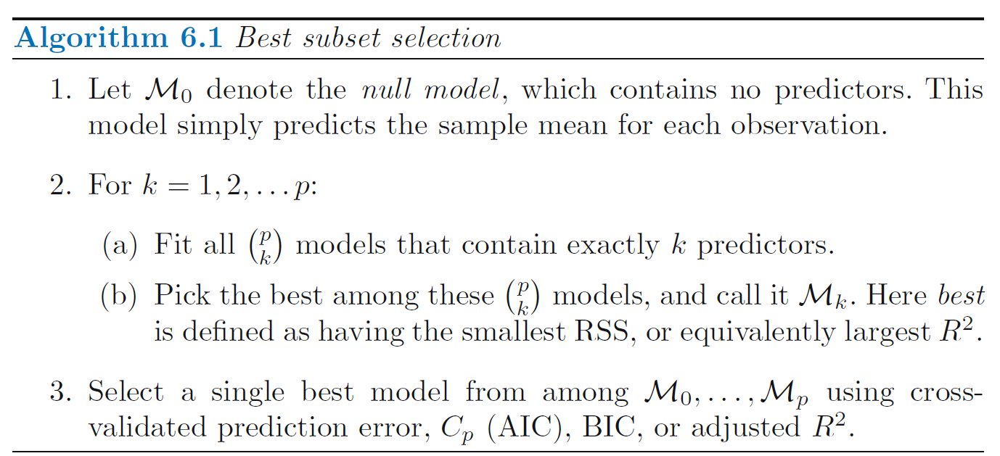


---


# Subset Selection: Best Subset Selection 

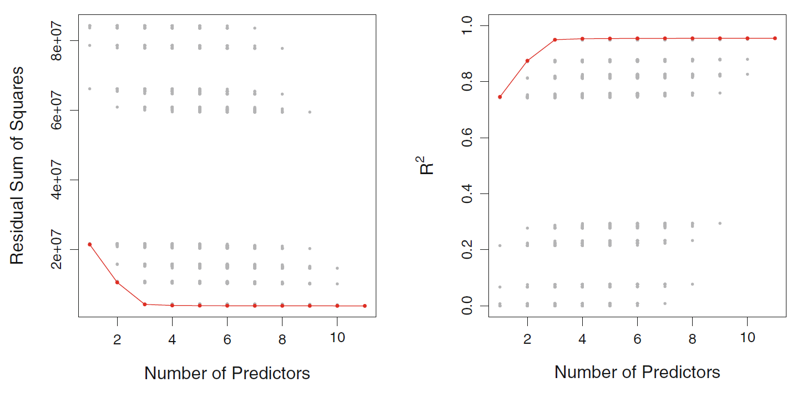

Each possible model with all predictors of `Credit` data set. Red frontier tracks the best model for a given number of predictors, according to $RSS$ and $R^2$

---


# Subset Selection: Stepwise Selection 

Stepwise methods explore a more restricted set of  models, reducing overfitting and reducing time to select/fit the model.


Three types: 

- Forward Stepwise

- Backward Stepwise

- Hybrid Approaches

---


# Subset Selection: Stepwise Selection 
## Forward Stepwise 
- Begins with a model containing no predictors
- Adds the predictor that gives the greatest improvement to the model
- Adds further predictors until all predictors are added
- Of all models created, the “best” is chosen
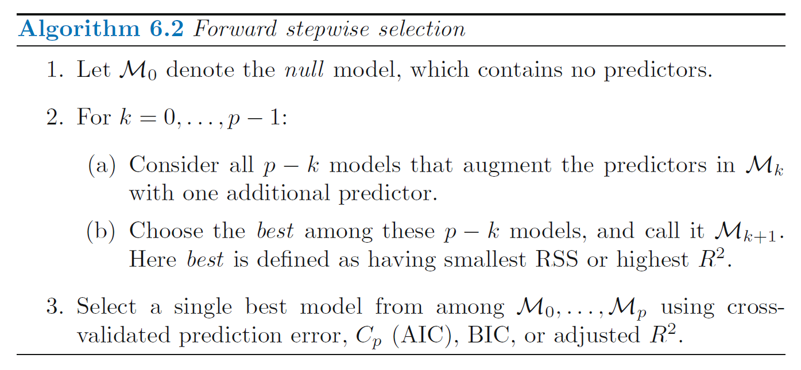


---

# Subset Selection: Stepwise Selection 
## Backward Stepwise 
- A model is built including all predictors
- At each step, the least-predictive is removed 
- Of each of the models produced by each step, the best model is selected
- Cannot be used when $n < p$
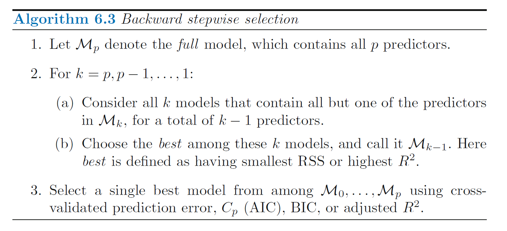


---

# Subset Selection: Stepwise Selection 
## Hybrid approaches

- Hybrid combine both forward and backward selection.

- These models begin with a null model and add predictors like forward selection.

- At each step, they also remove predictors that are less-informative, like backward selection. 


---


# Stepwise Selection vs Best Subset Selection

### Stepwise Selection:
- Faster than best subset selection
- Tractable for problems with $p > 40$


### Best Subset Selection
- Guaranteed to find the best possible model

---


# Subset Selection: Optimal Model 

“The model containing all of the predictors will always have the smallest $RSS$ and the
largest $R^2$, since these quantities are related to the training error.”


We wish to choose a model with a low test error.


### Estimating test error:

- Adjust the training error to account for bias

- Directly estimate with cross-validation or a validation set

---

# Subset Selection: Optimal Model
 ## Adjusting with $C_p$ 

<center>
 $C_p = \frac{1}{n}\left ( RSS + 2d \hat{\sigma}^2 \right)$
</center>
$~$
- For least-squares models with $d$ predictors

- An unbiased estimate of MSE, if $\hat{\sigma}^2$ is an unbiased estimate of $\sigma^2$

- The penalty increases as the number of predictors in the model increases

- Choose the model with the lowest $C_p$ value


---

# Subset Selection: Optimal Model
 ## Adjusting with Akaike Information Criterion $AIC$
<center>
$AIC = \frac{1}{n\hat{\sigma}^2}\left ( RSS + 2d \hat{\sigma}^2 \right)$
</center>
$~$
- For models fit with maximum likelihood

- Omitted a constant: Proportional to $C_p$

---

# Subset Selection: Optimal Model
 ## Adjusting with Bayesian Information Criterion $BIC$
<center>
$BIC = \frac{1}{n\hat{\sigma}^2}\left ( RSS + log(n)d\hat{\sigma}^2 \right)$
</center>
$~$
- For models fit with maximum likelihood 

- Omitted an additive constant

- Heavier penalty on the number of predictors than $C_p$

---

# Subset Selection: Optimal Model
 ## Adjusting with Adjusted $R^2$
<center>
$Adjusted R^2 = 1 - \frac{RSS/(n-d-1)}{TSS/(n-1)}$

$TSS = \sum (y_i − \bar{y})^2$
</center>
$~$
- Regular $R^2$ always increases with added predictors.

- The Adjusted $R^2$, is corrected for the number of predictors $d$, such that it may decrease as additional, less-informative predictors are added to the model. 

- A large value of Adjusted $R^2$ indicates a model with low test error.


---
# Subset Selection: Optimal Model
 ## Comparison: $C_p$ vs $BIC$ vs $R^2$

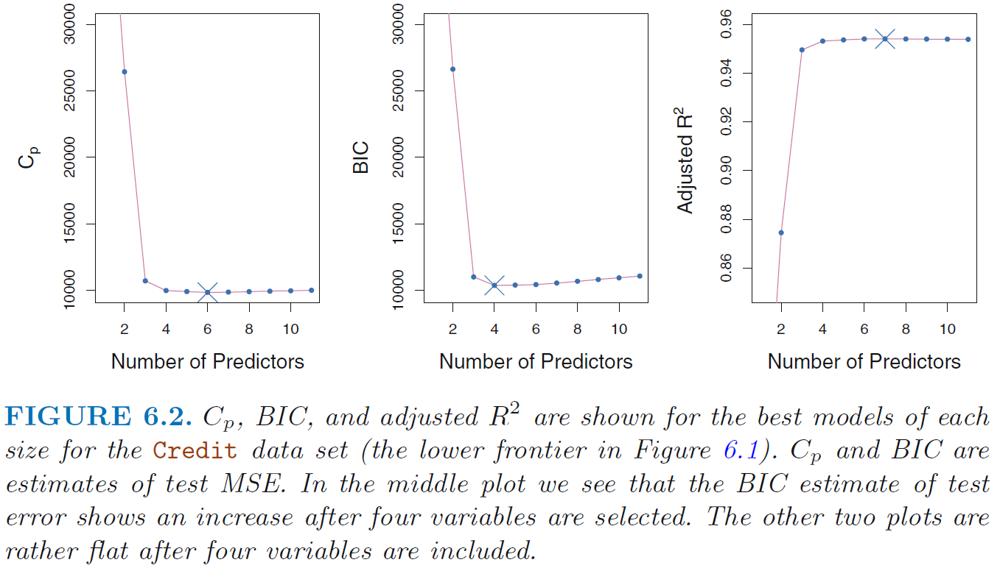

---
# Subset Selection: Optimal Model
 ## Estimating with Validation or Cross-Validation 

- Compute validation set error or cross-validation error for each model

- Select model with smallest test error 

- Directly estimated test error based on fewer assumptions


---

# Subset Selection: Optimal Model
 ## Comparison: Adjusting vs Estimating

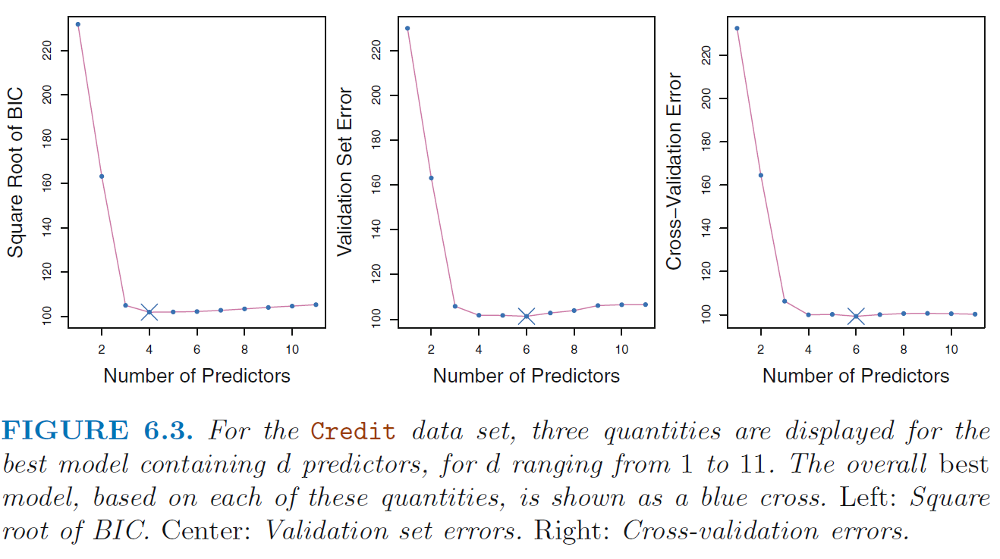

---

# Subset Selection: Optimal Model
 ## one-standard-error-rule

- Calculate the standard error of test MSE for each model.
Select the smallest model for which the estimated test error is within one SE of the lowest point in the curve. 

" The rationale here is that
if a set of models appear to be more or less equally good, then we might
as well choose the simplest model—that is, the model with the smallest
number of predictors. "


---

# Shrinkage methods

- Fit a model with all predictors that shrinks coefficient estimates towards zero

- Shrinking coefficient estimates can significantly reduce their variance

- Two best known shrinkage methods: ridge and lasso

- For both, ridge and lasso, predictors should be standardized, i.e.
  + substract mean
  + divide by variance


---


# Shrinkage methods: Ridge

- Very similar to least squares in that both methods select coefficients that reduce RSS

- Coefficients are estimated by minimizing slightly different quantity 

 
$~$
$~$
<center>

$\sum_{i=1}^{n}\left (y_i - \beta_0 - \sum_{j=1}^{p} \beta_j x_{ij}  \right )^2 + \lambda \sum_{j=1}^{p} \beta_j^2 = RSS + \lambda \sum_{j=1}^{p} \beta_j^2$


---

# Shrinkage methods: Ridge

<center>

$RSS + \lambda \sum_{j=1}^{p} \beta_j^2$ 

</center> 

### Shrinkage penalty
- Is small when coefficients close to zero
- Has the effect of shrinking $β_j$ toward zero
- Only applied to coefficients, not to the intercept

### Tuning parameter
- Controls impact of shrinkage penalty
- When $\lambda = 0$: Same results as least squares
- As $\lambda \rightarrow \infty$, coefficients approach zero
- Ridge offers a different set of coefficients for each value of $\lambda$
- Selecting a good value for $\lambda$ is critical

---


# Shrinkage methods: Ridge

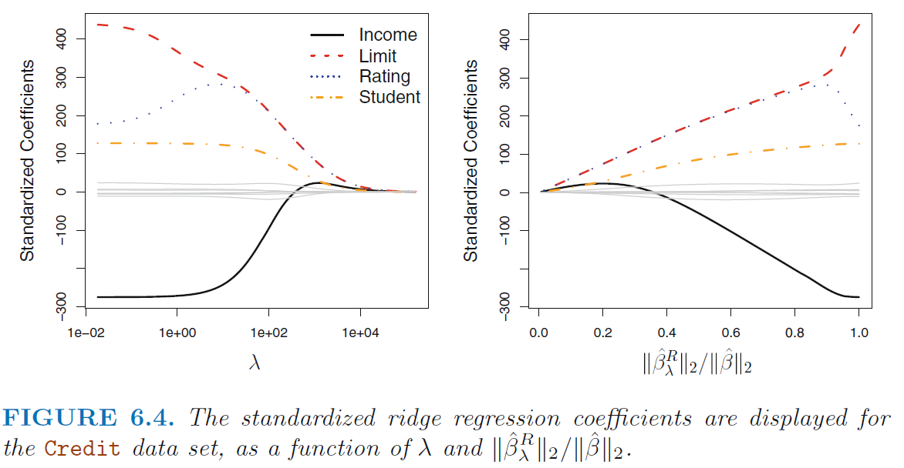

---

# Shrinkage methods: Ridge

- Unlike least squares, ridge is very scale dependent

- Therefore must standardize coefficients

- The following formula will ensure all coefficients have a standard deviation of one

$~$
$~$

<center>
$\tilde{x}_{i j} = \frac{x_{i j}}{\sqrt{\frac{1}{n} \sum_{i=1}^{n}\left(x_{i j}-\bar{x}_{j}\right)^{2}}}$

---

# Shrinkage methods: Ridge
- Advantage of ridge is rooted in the bias-variance trade-off
- As $\lambda$ increases, bias increases, but variance decreases

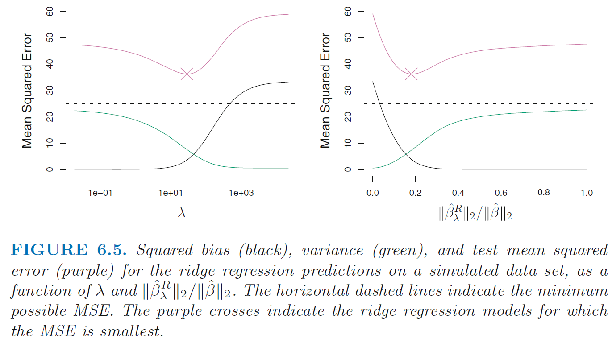

---


# Shrinkage methods: The Lasso

- Similar to Ridge, but with $|\beta_j|$, which forces some coefficients to be zero: Performs variable selection

- Creates models that are easier to interpret

- Shrinks coefficient estimates towards zero

$~$
$~$

<center>
$\sum_{i=1}^{n}\left(y_{i}-\beta_{0}-\sum_{j=1}^{p} \beta_{j} x_{i j}\right)^{2}+\lambda \sum_{j=1}^{p}\left|\beta_{j}\right|=\mathrm{RSS}+\lambda \sum_{j=1}^{p}\left|\beta_{j}\right|$


---

# Shrinkage methods: The Lasso

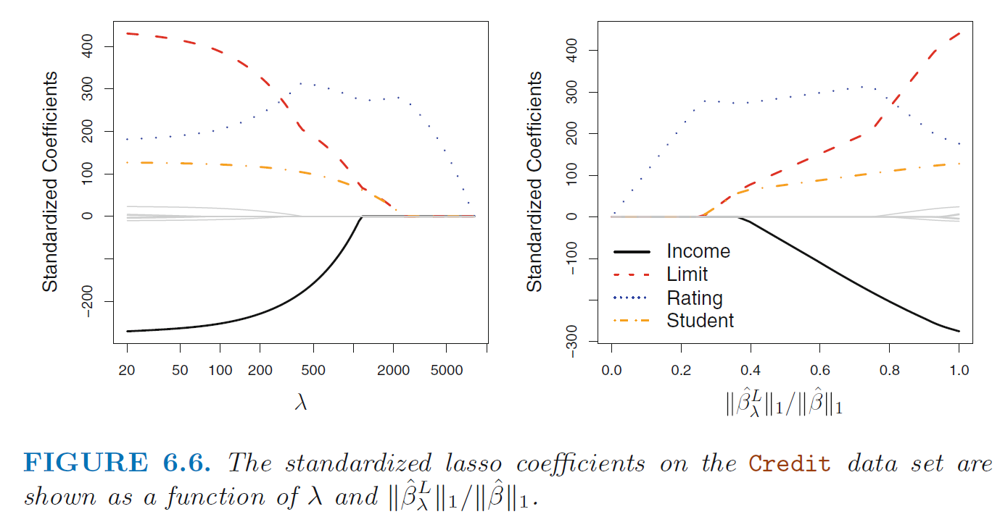

---


# Shrinkage methods: Alternative Formulation

### Ridge

<center>
$\underset{\beta}{\operatorname{minimize}}\left\{\sum_{i=1}^{n}\left(y_{i}-\beta_{0}-\sum_{j=1}^{p} \beta_{j} x_{i j}\right)^{2}\right\} \quad \text { subject to } \quad \sum_{j=1}^{p} \beta_{j}^{2} \leq s$
</center>

### Lasso

<center>
$\underset{\beta}{\operatorname{minimize}}\left\{\sum_{i=1}^{n}\left(y_{i}-\beta_{0}-\sum_{j=1}^{p} \beta_{j} x_{i j}\right)^{2}\right\} \quad \text { subject to } \quad \sum_{j=1}^{p}\left|\beta_{j}\right| \leq s$
</center>

- We are trying to find the set of estimates that lead to the smallest $RSS$, subject to the constraint that there is a budget $s$ 

- If $s$ is very large, it yields least squares solution


---

# Shrinkage methods: Graphical intuition

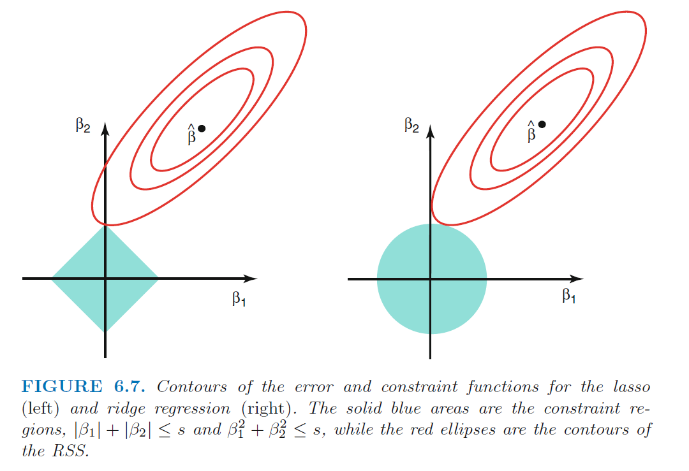

---

# Shrinkage methods: Ridge vs Lasso

- Qualitatively, both give very similar results.
For both, as $\lambda$ increases, variance decreases and bias increases

- If all predictors associated with outcome, ridge slightly outperforms lasso

- When not all predictors associated with outcome or when some predictors have very large coefficients, lasso slightly outperforms ridge

- Ridge regression more or less shrinks every dimension of the data by the same proportion, whereas the lasso more or less shrinks all coefficients toward or to zero by a similar amount

- Biggest advantage of lasso is variable selection, making model interpretation easier

- Use cross-validation to determine which technique is better for a particular dataset


---

# Shrinkage methods: Bayesian point of view 

- In Bayesian theory, we assume $\beta$ has a prior distribution: $p(\beta)$ Multiplying that prior by the likelihood gives us the posterior distribution. 

- If $p(\beta)$ follows a Gaussian distribution with mean 0 and SD that is a function of $\lambda$ then the most likely posterior value for $\beta$ is the ridge regression solution

- If $p(\beta)$ follows a Laplace distribution with mean 0 and a scale parameter of $\lambda$ then the most likely posterior value for $\beta$ is the lasso regression solution


---


# Shrinkage methods: Selecting $\lambda$

- Cross validation is a simple way to choose the best $\lambda$

 - Choose a grid of $\lambda$ values and compute cross-validation error for each value of $\lambda$
 - Choose $\lambda$ for which error is smallest

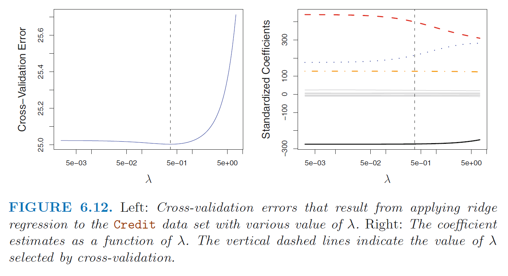

     
      
      
      
      
 ---
class: inverse, center, middle

# How to extract essential information from data: Principal component analysis

---
# PCA
## Example - Turtle data
* Jolicoeur and Mossiman’s 1960’s Painted Turtles Dataset with size variables for two turtle populations (contained in R package ade4)
```{r turtles1, include=TRUE, echo = FALSE, results = "asis"}
data(tortues)
turtles <- tortues
names(turtles) <- c("length", "width", "height", "sex")
turtlem <- as.matrix(turtles[, 1:3])

kable(head(turtles), format = 'html', caption = paste0("Table ", table.count, ": First lines of turtle data"), align = "c") %>%
  kable_styling(bootstrap_options = "striped", full_width = T)
table.count <- table.count + 1   
```

---
# PCA
## Example - Turtle data
.pull-left[
```{r turtles2, include=TRUE, echo = FALSE, results = "asis"}
kable(round(apply(turtlem,2,summary), 2), format = 'html', caption = paste0("Table ", table.count, ": Summary statistics on  turtle data"), align = "c") %>%
  kable_styling(bootstrap_options = "striped", full_width = T)

table.count <- table.count + 1
```
]

.pull-right[
```{r turtles3, include=TRUE, echo = FALSE, results = "asis", out.width = "100%", fig.cap = paste0("Fig. ", fig.count, ":  All pairs of bivariate scatterplots for the three biometric measurements on painted turtles")}
fig.count <- fig.count + 1
ggpairs(turtles[, -4], axisLabels = "none")
```

]
---
# PCA
## Example - Turtle data
* Data need to be standardized to make variables in a way comparable
  + center: substract mean - new variables have mean 0
  + scale: divide by standard deviation - new variables have standard deviation 1
  
```{r turtles4, include=TRUE, echo = FALSE, results = "asis", out.width = "45%", fig.cap = paste0("Fig. ", fig.count, ":  Turtles data projected onto the plane defined by the width and height variables: each point colored according to sex")}
fig.count <- fig.count + 1

# Plot probability distribution and mark rejection
scaledTurtles <- scale(turtles[, -4])

data.frame(scaledTurtles, sex = turtles[, 4]) %>%
  ggplot(aes(x = width, y = height, group = sex)) +
    geom_point(aes(color = sex)) + coord_fixed()

```
---
# PCA
## Aim: Dimension reduction

* Reduce a two-variable scatterplot to a single coordinate (Karl Pearson 1901)

* Summarize a battery of psychological tests run on the same subjects - provide overall scores (Hotelling 1933)

* PCA is an exploratory technique to show relations between variables

* PCA is called an unsupervised learning technique

  + all variables have same status
  
  + no distinction between dependent and independent variables

---
# PCA
## Aim: Dimension reduction

* Project points in high-dimensional space  to lower dimensions ("hyperplanes")
  + $i$-th principal component is the direction of a line that best fits the data while being orthogonal to the first $i − 1$ vectors
  + best-fitting line minimizes  average squared distance from the points to the line
  + these directions constitute an orthonormal basis in which different individual dimensions of the data are linearly uncorrelated

* Linear technique, i. e. new variables are linear functions (linear combinations) of the old ones

---
# PCA
## Summarize two-dimensional data by a line
* Aim: keep as much information as possible about both variables

* Linear regression of y on x

.pull-left[
```{r turtles5, include=TRUE, echo = FALSE, results = "asis", out.width = "50%", fig.cap = paste0("Fig. ", fig.count, ":  Regression of width on height")}
fig.count <- fig.count +1

reg1 = lm(width ~ height, data=data.frame(scaledTurtles))
a1 = reg1$coefficients[1] # intercept
b1 = reg1$coefficients[2] # slope

turt_gg <- ggplot(data.frame(scaledTurtles), aes(x = height, y = width)) +
  geom_point(size = 2, shape = 21)

pline1 = turt_gg + geom_abline(intercept = a1, slope = b1,
    col = "blue", lwd = 1.5)
pline1 + geom_segment(aes(xend = height, yend = reg1$fitted),
    colour = "red", arrow = arrow(length = unit(0.15, "cm")))
```
]

.pull-right[
* Linear regression of x on y

```{r turtles6, include=TRUE, echo = FALSE, results = "asis", out.width = "50%", fig.cap = paste0("Fig. ", fig.count, ":  Regression of height on width")}
fig.count <- fig.count +1

reg2 = lm(height ~ width, data=data.frame(scaledTurtles))
a2 = reg2$coefficients[1] # intercept
b2 = reg2$coefficients[2] # slope

turt_gg <- ggplot(data.frame(scaledTurtles), aes(x = height, y = width)) +
  geom_point(size = 2, shape = 21)

pline2 = turt_gg + geom_abline(intercept = -a2/b2, slope = 1/b2,
    col = "darkgreen", lwd = 1.5)
pline2 + geom_segment(aes(xend=reg2$fitted, yend=width),
    colour = "orange", arrow = arrow(length = unit(0.15, "cm")))
```
]
---
#A line that minimizes distances in both directions
```{r turtles7, include=TRUE, echo = FALSE, results = "asis", out.width = "50%", fig.cap = paste0("Fig. ", fig.count, ":  A line that minimizes distances in both directions - first principal component")}
fig.count <- fig.count +1
xy <- scaledTurtles[, c("width", "height")]

svda <- svd(xy)

pc <- xy %*% svda$v[, 1] %*% t(svda$v[, 1])
bp <- svda$v[2, 1] / svda$v[1, 1]
ap <- mean(pc[, 2]) - bp * mean(pc[, 1])
turt_gg + geom_segment(xend = pc[, 1], yend = pc[, 2]) +
  geom_abline(intercept = ap, slope = bp, col = "purple", lwd = 1.5)
```

---
# PCA
* Minimizing in both horizontal and vertical directions means in fact minimizing the orthogonal projections onto the line from each point.

* Total variability of the points is measured by the sum of squares of the projection of the points onto the center of gravity, i. e. the origin (0,0) - if the data are centered. 

* Total variability = the total variance = inertia of the point cloud. 

* Inertia can be decomposed into 
  + sum of the squares of the projections onto the line plus 
  + the variances along that line
  
* For a fixed variance, minimizing the projection distances 
    $\rightarrow$ maximizing the variance along that line

* Often define first principal component as the line with maximum variance

---
# PCA

* Note, technically, a singular Value decomposition is performed, i. e. we write $m \times n$ data matrix with rank $r$ as
* $M = U \Sigma V'$ where 
  + $U$ an $m \times m$ orthonormal matrix
  + $V'$ an $n \times n$ transposed of an orthonormal matrix $V$
  + $\Sigma$ an $m \times n$ matrix with rank $r$ of the form
$\Sigma=\left(\begin{array}{ccc|ccc}\sigma_{1} & & & & \vdots & \\ & \ddots & & \cdots & 0 & \cdots \\ & & \sigma_{r}&  &  \vdots & &\\ \hline & \vdots & & & \vdots & \\ \cdots & 0 & \cdots & \cdots & 0 & \cdots \\ & \vdots & & & \vdots & \end{array}\right)$

        with $\sigma_{1} \geq \cdots \geq \sigma_{r}>0$


---
# Singular value decomposition
## turtle data
.pull-left[
```{r turtles8, include=TRUE, echo = FALSE, results = "asis", out.width = "45%", fig.cap = paste0("Fig. ", fig.count, ":  bla bla")}
turtles.svd = svd(scaledTurtles)

kable(turtles.svd$d, format = 'html', 
      caption = paste0("Table ", table.count, ": Diagonal elements 'singular values'"), align = "c") %>%
  kable_styling(bootstrap_options = "striped", full_width = T)
table.count <- table.count + 1
```
]
.pull-right[
```{r turtles8a, include=TRUE, echo = FALSE, results = "asis", out.width = "45%", fig.cap = paste0("Fig. ", fig.count, ":  bla bla")}

kable(turtles.svd$v, format = 'html', 
      caption = paste0("Table ", table.count, ": Components of V"), align = "c") %>%
  kable_styling(bootstrap_options = "striped", full_width = T)
table.count <- table.count + 1

Z_1 = turtles.svd$v[1, 1] * scaledTurtles[, "length"] + turtles.svd$v[2, 1] *  scaledTurtles[, "width"]  + turtles.svd$v[3, 1] *  scaledTurtles[, "height"]
Z_2 = turtles.svd$v[1, 2] * scaledTurtles[, "length"] + turtles.svd$v[2, 2] *  scaledTurtles[, "width"]  + turtles.svd$v[3, 2] *  scaledTurtles[, "height"]
Z_3 = turtles.svd$v[1, 3] * scaledTurtles[, "length"] + turtles.svd$v[2, 3] *  scaledTurtles[, "width"]  + turtles.svd$v[3, 3] *  scaledTurtles[, "height"]
```
]

---
# PCA results for turtle data

* First column of turtles.svd$v shows: coefficients for the three variables are practically equal

* These are the coeffcients of the first principal component:

* $Z_1 =$ `r round(turtles.svd$v[1, 1], 3)` $\cdot$ length + `r round(turtles.svd$v[2, 1], 3)` $\cdot$ width  + `r round(turtles.svd$v[3, 1], 3)` $\cdot$ height

* Variance of principal components
  + $\mbox{var}(Z_1)$ = `r round(var(Z_1), 3)`
  + $\mbox{var}(Z_2)$ = `r round(var(Z_2), 3)`
  + $\mbox{var}(Z_3)$ = `r round(var(Z_3), 3)`

---
# PCA Extensions

See Federico's package `pcaexplorer`

---
# References
* Susan Holmes, Wolfgang Huber. Modern Statistics for Modern Biology. Cambridge University Press, 2019. The book is also online: https://www.huber.embl.de/msmb/

* Gareth James, Daniela Witten, Trevor Hastie, Robert Tibshirani. An Introduction to Statistical Learning. Second edition. Springer New York, 2021. PDF (legally) available at https://hastie.su.domains/ISLR2/ISLRv2_website.pdf

* Trevor Hastie, Robert Tibshirani. The Elements of Statistical Learning. pringer New York, 2009 PDF (legally) available at https://web.stanford.edu/~hastie/ElemStatLearn/printings/ESLII_print12_toc.pdf

* Frank E. Harrell. Regression Modeling Strategies. Second edition. Springer Cham 2015.

* https://en.wikipedia.org/wiki/Statistical_hypothesis_testing (especially for a comparison between Fisherian, frequentist (Neyman–Pearson) interpretation)

* https://xkcd.com/882/
