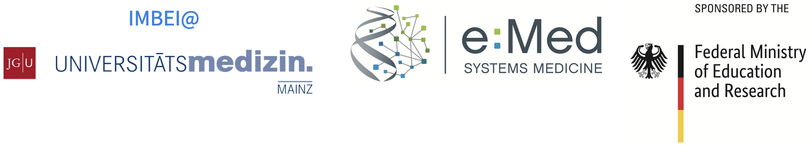

layout: true

```{r setup, include=FALSE}
options(htmltools.dir.version = FALSE)
knitr::opts_chunk$set(
  eval = TRUE,
  message = FALSE,
  echo = TRUE,
  warnings = FALSE,
  fig.align = "center"
)
```

```{r, eval=TRUE, echo=FALSE}
xaringanExtra::use_webcam()
```

---


class: center, middle

# Welcome to the GTIPI Summer School!

--

*It's been a while...*

*... but now it is really happening!*

---


class: center

# GTIPI

Bringing the pillars of systems medicine under the same roof

<p align="center">

</p>

---

class: center

# Funding

<br><br><br><br><br>
<p align="center">

</p>

---

class: center

# Topics

--

Introduction to Statistics, Machine Learning & Data Integration

--

Introduction to R/Bioconductor

--

Proteomics analysis

--

Genetic Epidemiology, Genomics, Genome Wide Association Studies  

--

Principles of Experimental Design & Differential Expression

--

Transcriptome analysis  
Single cell data analysis

--

Artificial Intelligence in Medicine, Image Recognition

--

Molecular Tumor Board: Integrating Clinical and Data Science

--

Evening session/Discussions  
Reproducible Research & R Markdown  
Data Visualization: Designing Scientific Figures  

---

class: center, middle

# Your instructors

.pull-left[
Irene Schmidtmann

Stefan Tenzer

Konstantin Strauch

Martina Müller-Nurasyid

Susanne Gerber
]

.pull-right[

Charlotte Soneson

Federico Marini

Torsten Panholzer

Claudia Paret
]

... and plenty of amazing TAs!

---

class: center, middle

# Participants

You all!

---

class: middle

# About the format

* Mixture of lectures and hands-on sessions

* Flashlight pitches + poster sessions

* Evening sessions - "tools of the trade" & more

* Material collected in dedicated GitHub repo

* Social event: Mainz, the Rhine, the Wine

---

class: center, middle

## Systems medicine won't be leaving science anytime soon...

Enjoy getting your feet wet with its foundational topics!

--

I'll be your contact on-site for all your needs!

---

<!-- empty slide -->

