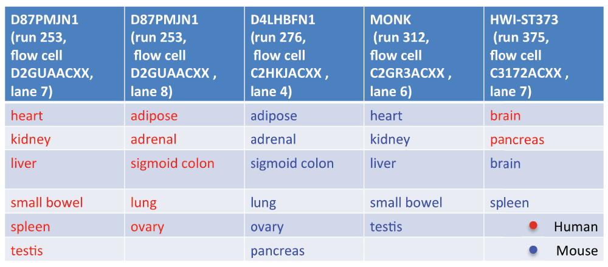
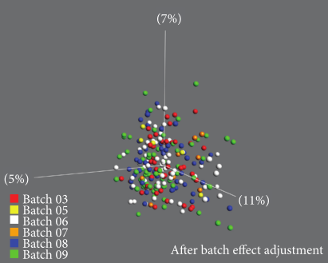

layout: true

```{r setup, include=FALSE}
options(htmltools.dir.version = FALSE)
knitr::opts_chunk$set(
  eval = TRUE,
  message = FALSE,
  echo = TRUE,
  warnings = FALSE,
  fig.align = "center"
)
```

---

# Overview

.Large[
* Conceptual overview of experiments
* Vocabulary for discussing experimental design
* Factors influencing the measurements in an experiment, and strategies for reducing their influence
* More details on how to adjust for batch effects in practice
* Discussion about confounding
* Overview of different types of replicates
* Practical exercises to illustrate how experimental design choices affect the ability to draw conclusions from an experiment
]

---

# What is experimental design?

<center>
.full-width[.small-content-box-purple[
.Large["The organization of an experiment, to ensure that the **right type** of data,<br>and **enough** of it, is available<br>to answer the **questions of interest** as clearly and efficiently as possible."] 
]]
</center>

--

<center>
.full-width[.small-content-box-purple[
.Large["Good experimental design begins with the end in mind."]
]]
</center>

--

* .Large[What is my .red[hypothesis]?] 
* .Large[What am I going to .red[measure] (and how is this relevant to the hypothesis)?]
* .Large[What .red[other factors] affect this outcome measure (and am I controlling these appropriately)?]
* .Large[What groups do I want to .red[compare]?]

<div class="my-footer"><span>http://www.stats.gla.ac.uk/steps/glossary/anova.html#expdes; Watkins (2016), doi:10.12746/swrccc2017.0517.226</span></div>

???
* What is the population of interest?
* Importantly, the optimal design depends on the question that you would like to address!
  * Example: take care to include the right type of controls. When comparing groups, any differences between them will be picked up, whether they are caused by biology, technical/protocol differences or batch effects.
* Experimental design is intimately related to what you actually want to get out of your experiment.

---
background-image: url("images/be-more-explicit.png")
background-position: center
background-size: 90%
class: inverse

# A couple of motivating examples

---

# Case study: Lin et al (PNAS, 2014)

<div class="pull-left" style="width: 40%">
<center>
.full-width[.content-box-yellow[
.large["In this study of a broad number of tissues between humans and mice, high-throughput sequencing assays on the transcriptome and epigenome reveal that, in general, differences dominate similarities between the two species."]<br><br>
".large[[...] well beyond what was described previously, likely reflecting the fundamental physiological differences between these two organisms."]
]]
</center>
</div>

--

<div class="pull-right" style="width: 58%">
<center>


Subset of 13 mouse tissues and 13 human tissues with data generated at the same site (Stanford)
{{content}}
</center>
</div>

<div class="my-footer"><span>Lin et al (2014), doi:10.1073/pnas.1413624111</span></div>

???
ENCODE consortium, set out to address a difficult question
Results were a bit surprising, but argued that previous studies had been biased by using a small set of tissues, and focusing on tissue-specific genes etc.
"Overall, our results indicate that there is considerable RNA expression diversity between humans and mice, well beyond what was described previously, likely reflecting the fundamental physiological differences between these two organisms."

---

# Gilad & Mizrahi-Man (F1000Research 2015)

<div class="pull-left" style="width: 40%">
<center>

</center>
</div>

--

<div class="pull-right" style="width: 58%">
<center>

</center>
Species is .red[confounded] with sequencing machine.
{{content}}

--

<ul>
<li> Differences on the sample level 
  <ul><li> human - heterogeneous set of deceased individuals (18-66 years), tissue flash frozen, RNA for three tissues acquired commercially.</li>
  <li> mouse - single strain, similar age (10 weeks), unclear whether tissue was flash frozen.</li></ul></li>
<li>Tissues not sex-matched</li>
</ul>
{{content}}

</div>

<div class="my-footer"><span>Gilad & Mizrahi-Man (2015), doi:10.12688/f1000research.6536.1</span></div>

???
Went into fastq files to extract info about sequencer, flow cell, lane
None of the possible confounders were reported in the paper
According to the authors, "22 of the libraries were constructed in a single batch and sequenced on four lanes"

---

# Follow-up experiments triggered

* Resequencing of a subset of the tissue samples with a non-confounded sequencing design - similar conclusions.
  * Doesn't address the underlying sample differences

<center>

</center>

--
* Analysis of Fantom5 CAGE data (matched human and mouse) - same conclusions. 
--

* Analysis of GTEx tissue samples
  * "Neither sex nor age contributed to the clustering in the first two principal components. Thus, these effects are likely to be small and have not been included in the studies of others as well."
  

???
The second set did not include ovary (exhausted material), different model sequencing instruments were used, and the reagents from the supplier were different. Also, the RNA may have changed over the two years since their extraction from tissue, especially for spleen and pancreas.

---

# Can we fix it in the analysis?

.pull-left[

]

.pull-right[
- .large[Batch effect adjustment effectively "equalizes" or "aligns" the different batches.]
- .large[By construction, this removes systematic shift between different sequencing runs.]
- .large[**Unavoidably**, this removes also of the species effect (the species are sequenced in different batches).]
- .large[There's _no way_ to determine the source of the signal based on this data alone.]

]

???
Global normalization is not enough - batch effects are gene-specific. 
This is an annoying place to be - we've spent all the money collecting the data, and we can't say anything. Maybe the conclusions were right, maybe not. We'll need to collect more data to figure out what's happening and estimate the size of any confounding effect separately, and try to impose that on the original experiment.

---

# So - what can we conclude?

<center>

</center>

<div class="my-footer"><span>https://media.giphy.com/media/K6VhXtbgCXqQU/giphy.gif</span></div>

---

# Case study II (Larsen et al, BioMed Res Int 2014)

* Gene expression data from samples from five breast cancer subtypes, processed across six batches.
* Batch signal dominates in uncorrected data.

.pull-left[
<center>

</center>
]

.pull-right[
<center>

</center>
]

<div class="my-footer"><span>Larsen et al (2014), doi:10.1155/2014/651751</span></div>

???
This is a common way of diagnosing batch effects etc. Plot data, overlay any known info about the samples. 

---

# Case study II (Larsen et al, BioMed Res Int 2014)

.pull-left[
<center>

</center>
]

--

.pull-right[
<center>

</center>
]
{{content}}

--

* After batch correction, the subtypes represent the strongest signal in the data.
* This was **only** possible since the subtypes were spread randomly across the analysis batches!
* This illustrates that it's not (mainly) the presence of batch effects _per se_, but the confounding with the signal of interest, that causes problems for the analysis.
{{content}}

<div class="my-footer"><span>Larsen et al (2014), doi:10.1155/2014/651751</span></div>

---

# How do we 'adjust for' batch effects?

<center>

</center>

<div class="my-footer"><span>Larsen et al (2014), doi:10.1155/2014/651751</span></div>

???
This is a common way of diagnosing batch effects etc. Plot data, overlay any known info about the samples. 

---

# How do we 'adjust for' batch effects in statistical modeling?
    
* .large[In statistical modeling (e.g., differential expression analysis), batch effects can be included as covariates (additional predictors) in the model.]

$$y = \beta_0 + \beta_1\cdot batch + \beta_2\cdot condition + \varepsilon$$

* .large[Note that if ] $batch$ .large[ and ] $condition$ .large[ coincide, we can at best hope to estimate ] $\beta_1 + \beta_2$.
--

* .large[For exploratory analysis, we often attempt to "eliminate" or "adjust for" such unwanted variation in advance, by subtracting the estimated effect from each variable (e.g. the expression of a gene).]
  * .large[Not recommended before statistical modelling, since the variance will be underestimated.]

--
* .large[Even partial confounding between batch and signal of interest can lead to problems.]

---


# Adjusting for batch effects - nonconfounded setup

<center>

</center>

---

# Adjusting for batch effects - confounded setup

<center>

</center>

---

# Adjusting for batch effects - partly confounded setup

<center>

</center>

---

# What can we learn from this?

- .large[Acknowledge that lots of factors can affect measurements in (biological) experiments]

<center>

</center>

--
- .large[We (typically) can't change the fact that these factors _do_ affect the measurements, so we have to adapt accordingly.]
--

- .large[Spending some extra time thinking through the experiment _before_ starting to collect the data can save a lot of time and headache later on.]
--

- .large[Always record as much information as possible about the samples, and share it with whoever analyzes the data. If you are the data analyst - ask questions!]
--

- .large[Avoid confounding between the factor of interest and any source of unwanted variation.]

<div class="my-footer"><span>Lazic (2016), isbn:978-1107424883</span></div>

???
We can't change the fact that these factors impact the measurements, we just need to design the experiment so that we can still say something about what we want
 (we'll talk about randomization and blocking later)

---

# Always beware of confounding

.Large[
* Careful design is always important - beware of confounding e.g. in situations where we
  * have to split a large data set into multiple analysis batches
  * use a control group from another (public) data set
  * use different reagent batches
  * collect an expanding data set (adding one condition at a time)
  * work in collaborative projects, where each center generates a subset of the data
  * change some aspect of the sample/library preparation protocol
  * work on an instrument with a drift/degradation over time
  * work with samples that degrade over time
  * ...
]

---

# So why should we care about experimental design? 

.pull-left[
.Large[
* Improved reproducibility of results
* Improved validity and generalizability of conclusions
* Efficient and ethical use of resources
  * Make sure that the design is adequate for answering the question of interest
  * Avoid having to repeat poorly designed experiments
  * Avoid spending resources on non-interpretable experiments
]
]

.pull-right[


<div class="my-footer"><span>Adapted from Baker (2016), doi:10.1038/533452a</span></div> 

]

???
We'll talk about some strategies to avoid ending up in a situation where you are not able to address the question of interest with your experimental data.

---
background-image: url("images/field-experiment.jpeg")
background-position: center
background-size: cover
class: inverse

# Experimental design principles

---

# Different types of experiments

.pull-left[
.full-width[.content-box-red[
* **Learning** experiments
  * Discover as much as possible about a condition/situation/phenomenon, generate new hypotheses.
  * Example: "Does stress affect rodent behaviour?"
  * Heterogenous subjects and environment.
  * Several treatments/time points.
]]
]

--

.pull-right[
.full-width[.content-box-green[
* **Confirming** experiments
  * Verify/validate an observation (typically from a learning experiment or literature).
  * Example: "Does fox urine odour affect the amount of food Wistar rats consume during the first 24 hours after exposure?"
  * Standardized subjects and environment.
  * Small number of treatments/time points.
]]
]
{{content}}

--

* Both types of experiments are valuable.
* Most high-throughput experiments today are learning experiments.
* Beware of learning experiments that are _presented_ as confirming experiments.
  * Example: many protocols are tested, only the results from the "best" one are shown.
* Data from a learning experiment should not be reused in a follow-up confirming experiment.
{{content}}

<div class="my-footer"><span>Adapted from Lazic (2016), isbn:978-1107424883; Sheiner (1997), doi:10.1016/S0009-9236(97)90160-0</span></div> 

???
Look a bit more into the last point in the next session


---

# How to deal with the impact of unwanted variation?

<br><br><br><br>
<center>

</center>

???
* Most of the time, our goal is to estimate treatment effects as well as possible. 
* (Technical) factors that are not of direct interest are often collectively referred to as 'batch effects'.
* We (typically) can't do much about the fact that all these factors _have_ an effect on our measurements.
* What we can (and should) do is to design our experiments in such a way that the impact on our ability to draw conclusions is minimized.

<div class="my-footer"><span>Lazic (2016), isbn:978-1107424883</span></div> 

---

# How to deal with the impact of unwanted variation?

.full-width[.small-content-box-gray[
* .large[**Minimize** it by holding factors constant (e.g., only considering female mice). This reduces unwanted variability, **but** we can't generalize our conclusions to groups that are not included!]
]]
--
.full-width[.small-content-box-gray[
* .large[Use **blocking** to balance the factor of interest across confounding factors. E.g., assign treatment group randomly within each sex group.] 
  * Extreme example: blocking _within each biological sample_ (e.g., take measurement from each mouse before and after a treatment). This leads to a **paired design**. 
]]
--
.full-width[.small-content-box-gray[
* .large[Use **randomization** to hopefully balance out the impact of any unknown confounder. Useful for unknown effects as well as effects that can only be measured at the end of the experiment.]
]]

<div class="my-footer"><span>Adapted from https://stanlazic.github.io/pres/2018_Lazic_reproducibility.pdf</span></div> 

---

# Example

.large[
* Let's say that you are collecting data from four untreated and four treated mice. 
* You can only collect and prepare data from four mice per day/session.
* How do you split your mice? Why? 
  * All replicates of one treatment in the same session to maximize the similarity among replicates
  * Completely random assignment
  * Replicates with each treatment evenly distributed between the two sessions
]


---

background-image: url("images/minions.jpg")
background-position: center
background-size: cover
class: inverse

# Replication

---

# Why do we need replicates?

* .Large[Required to estimate within-group variability, which is then compared to the observed between-group difference in statistical tests.]


---

# Not all replicates are equal!

.Large['Technical' vs 'biological' replicates]

<center>

</center>

--

.Large[Common terminology, but sometimes confusing/not specific enough.]

<div class="my-footer"><span>Klaus (2015), doi:10.15252/embj.201592958</span></div> 

---

# Another classification approach

.pull-left[
.full-width[.content-box-green[
* .Large[.red[Biological units] (BU) - entities we want to make inferences about (e.g., animal, person).]
* .Large[.red[Experimental units] (EU) - the smallest entities that can be independently assigned to a treatment (e.g., animal, litter, cage, well).]
* .Large[.red[Observational units] (OU) - entities at which measurements are made.]
]]
]

.pull-right[

]

<div class="my-footer"><span>Lazic (2016), isbn:978-1107424883</span></div> 

---

# Another classification approach

.pull-left[
.full-width[.content-box-green[
* .Large[.red[Biological units] (BU) - entities we want to make inferences about (e.g., animal, person).]
* .Large[.red[Experimental units] (EU) - the smallest entities that can be independently assigned to a treatment (e.g., animal, litter, cage, well).]
* .Large[.red[Observational units] (OU) - entities at which measurements are made.]
]]
]
.pull-right[
* .Large[Replication of .red[biological units] is required to make a general statement of the effect of a treatment - you can't draw a conclusion about the effect of a compound on people in general by observing the effect in one person.] 
* .Large[Only replication of .red[experimental units] is true replication (independent error terms).]
]

---

# Not all replicates are equal


<div class="my-footer"><span>https://xkcd.com/2533/</span></div> 

---

# Experimental design checklist

<input type="checkbox" unchecked> I have a well-defined scientific question or hypothesis to investigate (recall learning vs confirming experiments).</input>
<br>
<input type="checkbox" unchecked> I have thought about how the data will be analyzed (e.g., which comparisons will be done, and what can be learnt from each of them). In particular, I have considered what a suitable 'control' group is for the effect I am interested in.</input>
<br>
<input type="checkbox" unchecked> The groups that I am planning to compare differ only in the aspect I am interested in investigating. Other confounders (technical/protocol differences, batch effects) are accounted for to the fullest extent possible.</input>
<br>
<input type="checkbox" unchecked>I have considered which biological or technical factors that might influence my measurements, and decided how to handle them (ignoring, eliminating, blocking, randomizing). Sources of (unwanted) variation are not confounded with the effect of interest.</input>
<br>
<input type="checkbox" unchecked> I have a suitable type and amount of replication, which allows me to generalize the results to the desired population.</input>
<br><br><br>
<center>
.full-width[.content-box-purple[
.Large[Always record and report as much information as possible.]
]]
</center>
