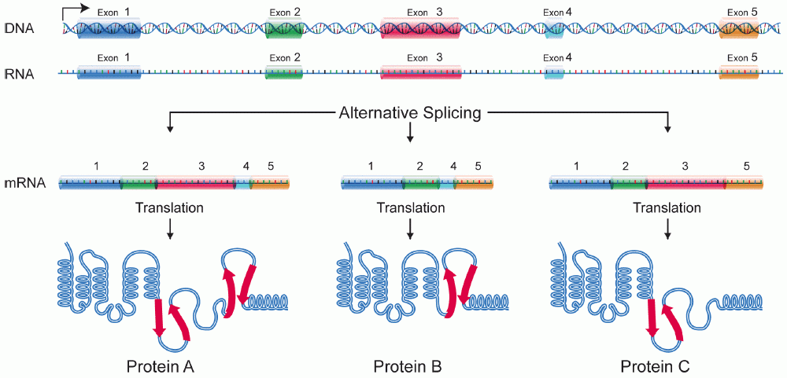

layout: true

```{r setup, include=FALSE}
options(htmltools.dir.version = FALSE)
knitr::opts_chunk$set(
  eval = TRUE,
  message = FALSE,
  echo = TRUE,
  warnings = FALSE,
  fig.align = "center"
)
```

```{r, eval=TRUE, echo=FALSE}
xaringanExtra::use_webcam()
```

---

---

### Questions

--

What are the steps to process RNA-Seq data?
- How to convert RNA-seq reads into counts?
- How to perform quality control (QC) of RNA-seq reads?

--

How to identify differentially expressed genes across multiple experimental conditions?
- How to properly analyze RNA count data using DESeq2?
- How to perform quality control (QC) and exploratory data analysis (EDA) of RNA-seq count data?

--

What are the biological functions impacted by the differential expression of genes?
- How can I perform a gene ontology enrichment analysis?

--

How can I create neat visualizations of the data?
- How can I visualize the results for my enrichment analysis?

--

How can I generate interactive reports to summarise my analyses?

---

### Questions

**What are the steps to process RNA-Seq data?**
- How to convert RNA-seq reads into counts?
- How to perform quality control (QC) of RNA-seq reads?

**How to identify differentially expressed genes across multiple experimental conditions?**
- How to properly analyze RNA count data using DESeq2?
- How to perform quality control (QC) and exploratory data analysis (EDA) of RNA-seq count data?

What are the biological functions impacted by the differential expression of genes?
- How can I perform a gene ontology enrichment analysis?

How can I create neat visualizations of the data?
- How can I visualize the results for my enrichment analysis?

**How can I generate interactive reports to summarise my analyses?**

---

# What you will learn

- the basics of RNA-seq data

--

- the basics of RNA-seq data analysis

--

- to get familiar with the concepts of gene expression, high-dimensional data, expression quantification, differential expression analysis

--

- the importance to pose the right question, in order to get the right answer :)


---

# Setup for practical sessions

Got R/RStudio?

Latest versions highly recommended!

See https://imbeimainz.github.io/GTIPI2022/material.html for details!

---


# Decomposing the title

### RNA

--

### Sequencing

--

### Bioinformatics

--

### Transcriptome

--

### Analysis

---

# (messenger) RNA

<p align="center">

</p>

---

# (messenger) RNA

<p align="center">

</p>

Exons, introns, transcripts, isoforms

---

# Sequencing

<p align="center">

</p>

4 base pairs, 21 aminoacids

Excellent review on next-generation sequencing: [`https://www.nature.com/articles/nrg.2016.49`](https://www.nature.com/articles/nrg.2016.49)

---

# RNA-sequencing

<p align="center">

</p>

- RNA quantification at single base resolution
- Cost efficient analysis of the whole transcriptome in a high-throughput manner

---

# Challenges in RNA-seq

- Different origin for the sample RNA and the reference genome
- Presence of incompletely processed RNAs or transcriptional background noise
- Sequencing biases (e.g. PCR library preparation)

--

Benefits

- sensitive
- specific
- high-throughput
- cost-efficient
- basepair resolution

You can see: transcripts, splicing, lncRNA, circRNA, gene fusions

---

# Bioinformatics

> "an interdisciplinary field that develops methods and software tools for understanding biological data, in particular when the data sets are large and complex."

--

A combination of

- biology
- computer science
- information engineering
- mathematics
- statistics 

... to analyze and interpret the biological data


---

# Transcriptome

Gene expression is a fundamental level at which the results of various genetic and regulatory programs are observable.

--

RNA sequencing (RNA-seq) provides a quantitative and open system for profiling transcriptional outcomes on a large scale

--

Much has been learned about the characteristics of the RNA-seq data sets, as well as the performance of the myriad of methods developed

.footnote[
"RNA Sequencing Data: Hitchhiker's Guide to Expression Analysis" ->
[`https://www.annualreviews.org/doi/abs/10.1146/annurev-biodatasci-072018-021255`](https://www.annualreviews.org/doi/abs/10.1146/annurev-biodatasci-072018-021255)
]

---

# Analysis

There's data involved!

--

and these datasets have particular properties (how they are generated, ...)

--

How to make sense out of it?

--

There is a large diversity of applications to deal with

--

Among the most widely adopted workflows: 
<!-- identify the molecular players of an observed phenotype, a.k.a. differential expression analysis -->

- Transcript discovery

    > *Which RNA molecules are in my sample?*

    > Novel isoforms and alternative splicing, Non-coding RNAs, Single nucleotide variations, Fusion genes

- RNA quantification

    > *What is the concentration of RNAs?*

    > Absolute gene expression (within sample), Differential expression (between biological samples)

---

# Analysis - a bird's eye view

<p align="center">

</p>

---

# Differential analysis types for RNA-seq

No single available standardized workflow  
Multiple possible best practices for every dataset

--

To get the right answer, you have to pose the right question.

--

- Does the total output of a gene change between conditions? Differential Gene Expression (DGE)

--

- Does the expression of individual transcripts change? Differential Transcript Expression (DTE)

--

- Does any isoform of a given gene change? DTE+G

--

- Does the isoform composition for a given gene change? Differential Transcript Usage/Differential Exon Usage (DTU/DEU)

--

Each needs different computational approaches (quantifications + tests)

---

## Overview of the processing workflow

<p align="center">

</p>

Ingredients + operations

---

# The raw data: sequencing reads

FASTQ files: sequence + base quality (phred score)

--

First lines of a FASTQ file

```
@SRR1055095.1 HWI-ST156:397:D09NJACXX:5:1101:1222:1915/1
NGCTGCTGGACTCCGAAGATGGGCGGTATATCATCCCACTGCTGACTCTN
+
#1=DDFFFHFHHHJJHIIGHIJJGIJAFDDHGGGIJJGJIJJJIJJIIH#
@SRR1055095.2 HWI-ST156:397:D09NJACXX:5:1101:1245:1920/1
NCTTTTCTTTGTTCTCATCATCTTCAGGAGGAGGAGGGTCATCCTTGTGN
+
#1=BDB:?FFDFFDF?EF<FFF>B>?C@CF<1??CFB:09;09BFE9DB#
```

--

Repeat this tens of millions of times, and you'll have _one_ sample

---

# The raw data: sequencing reads

Different quality encodings exist

<p align="center">

</p>

---

# The raw data

Demo: quality control report, from FastQC

http://www.bioinformatics.babraham.ac.uk/projects/fastqc/good_sequence_short_fastqc.html

--

Your next best friend: MultiQC

--

Common sequence artefacts in NGS data:

* read errors
* base calling errors
* small insertions and deletions
* poor quality reads
* primer/adapter contamination

Solutions:
Quality trimming & filtering (wide range of QC tools available)

---

# Reference files

Reference genome sequences (in `fasta` format), required for genome alignment.

--

Think of the alignment as the address of each read in a 3-billion houses street, where the elements along the street can also end up repeating themselves.

--

#### What's out there?

Ensembl: http://www.ensembl.org/info/data/ftp/index.html

Gencode (human & mouse): https://www.gencodegenes.org/

UCSC: http://hgdownload.cse.ucsc.edu/downloads.html

iGenome: http://support.illumina.com/sequencing/sequencing_software/igenome.html

---

# Reference files

Some critical points:

--

Be consistent!

--

Different chromosome identifiers!

--

Reference genomes and annotations are continuously refined, extended and improved

--

Keep track of version and be consistent!

--

Naming of genes can vary across versions, in some databases!

---

# Reference files

An example:

[`http://ftp.ensembl.org/pub/release-106/fasta/homo_sapiens/dna/`](http://ftp.ensembl.org/pub/release-106/fasta/homo_sapiens/dna/)

... and one level up...

[`http://ftp.ensembl.org/pub/release-106/fasta/homo_sapiens/`](http://ftp.ensembl.org/pub/release-106/fasta/homo_sapiens/)

--

```
>1 dna:chromosome chromosome:GRCh38:1:1:248956422:1 REF
NNNNNNNNNNNNNNNNNNNNNNNNNNNNNNNNNNNNNNNNNNNNNNNNNNNNNNNNNNNN
NNNNNNNNNNNNNNNNNNNNNNNNNNNNNNNNNNNNNNNNNNNNNNNNNNNNNNNNNNNN
NNNNNNNNNNNNNNNNNNNNNNNNNNNNNNNNNNNNNNNNNNNNNNNNNNNNNNNNNNNN
NNNNNNNNNNNNNNNNNNNNNNNNNNNNNNNNNNNNNNNNNNNNNNNNNNNNNNNNNNNN
...
TTGGTGCCAGTTCCTCCAAGTCGATGGCACCTCCCTCCCTCTCAACCACTTGAGCAAACT
CCAAGACATCTTCTACCCCAACACCAGCAATTGTGCCAAGGGCCATTAGGCTCTCAGCAT
GACTATTTTTAGAGACCCCGTGTCTGTCACTGAAACCTTTTTTGTGGGAGACTATTCCTC
CCATCTGCAACAGCTGCCCCTGCTGACTGCCCTTCTCTCCTCCCTCTCATCCCAGAGAAA
CAGGTCAGCTGGGAGCTTCTGCCCCCACTGCCTAGGGACCAACAGGGGCAGGAGGCAGTC
```

---

# Reference files

The GTF format

```
chr1    unknown exon    11874   12227   .       +       .       gene_id "DDX11L1"; gene_name "DDX11L1"; 
transcript_id "NR_046018"; tss_id "TSS16107";
chr1    unknown CDS     3427347 3427466 .       -       2       gene_id "MEGF6"; gene_name "MEGF6";
p_id "P34437"; transcript_id "NM_001409"; tss_id "TSS31177";
```

* One line per "feature" (exon, transcript, gene, CDS, 3'UTR, 5'UTR, ...)
* One feature = 9 columns of data, plus optional track definition lines
* Essential for releasing annotation information

--

Fields:

    seqname - name of chromosome/scaffold
    source - data/program source
    feature - feature type name
    start - positions of the feature
    end
    score - floating point value
    strand - forward or reverse
    frame -  0|1|2
    attribute - semicolon-separated list of tag-value pairs, providing 
    additional information

---

# Bioconductor

<p align="center">

</p>

---

# Bioconductor - soon your best friend

- an open source project
- a repository of packages, focused on bioinformatics/computational biology
- a open development platform and community

--

Currently (May 2022)

- 2140 software packages
- 909 annotation packages
- 410 experiment packages
- 29 workflows
- 8 books

**Aim**: interdisciplinary research, collaboration and rapid development of scientific software

--

### Documentation

- function manual pages, most of them with runnable examples
- package vignettes - mandatory here!
- workflows, documenting full analyses spanning multiple tools
- a very active support site

---

# The real deal: Bioconductor's community

<p align="center">

</p>

---

# Data processing

Turning millions of text lines into properly structured abundance tables

--

Our aim: we often want to compare abundance (expression) of genes or other features between conditions

Splice-aware genome alignment vs "direct" transcript mapping and quantification


---

# Alignment: not just simple mapping

<p align="center">

</p>

--

For RNA-seq data, we need a splice-aware aligner

Common choices:
- STAR
- HISAT2

---

# Alignment

File-format: `sam` (compressed into `bam`)

```
SRR1055095.6079377  353  chr1	11167	0	50M	=	11751	634	CGCCCCTTGCTTGCAGCCGGGCAC
TACAGGACCCGCTTGCTCACGGTGAA	CCCFFFFFHHHHHJJJJJJJJJJJJIGJJJIJJJJJJJJJJJDHJJCEHH	
AS:i:-10	XN:i:0	XM:i:2	XO:i:0	XG:i:0	NM:i:2	MD:Z:48C0T0	YT:Z:UU	NH:i:20	
CC:Z:chrY	CP:i:59361513	HI:i:0

```

Again: repeat this, one read at a time!

Entries:

    QNAME - Query NAME of the read or the read pair
    FLAG - Bitwise FLAG (pairing, strand, mate strand, etc.)
    RNAME - Reference sequence NAME
    POS - 1-Based leftmost POSition of clipped alignment
    MAPQ - MAPping Quality (Phred-scaled)
    CIGAR - Extended CIGAR string (operations: MIDNSHP)
    MRNM - Mate Reference NaMe (‘=’ if same as RNAME)
    MPOS - 1-Based leftmost Mate POSition
    ISIZE - Inferred Insert SIZE
    SEQ - Query SEQuence on the same strand as the reference
    QUAL - Query QUALity (ASCII-33=Phred base quality)
    Tags: used to store info about alignment
    
---

# Before quantification

... and actually, always: Do visualize your data!

Options: UCSC Genome Browser, IGV, IGB - [`http://software.broadinstitute.org/software/igv/`](http://software.broadinstitute.org/software/igv/)

--

<p align="center">

</p>


---

# Quantification  

Ingredients: BAM data + GTF annotation file

Output: number of reads overlapping known features (discrete, positive, skewed)

Gene-level counts, often obtained by  genome alignment + overlap counting

<p align="center">

</p>

---

# The role of annotation

<p align="center">

</p>

---

# The annotation matters!

<p align="center">

</p>

---

# The annotation matters!

<p align="center">

</p>

---

# Alignment-free quantifications

Some recently developed methods:

- salmon (Patro et al, Nat Methods 2017)  
- kallisto (Bray et al, Nat Biotechnol 2016)

--

return...

* Transcript-level counts and TPM (transcripts-per-million) estimates, which can be summed up to get  
* Gene-level counts and TPM estimates

--

Pros & cons

- considerably faster than traditional alignment+counting -> allow bootstrapping
- more highly resolved estimates (transcripts rather than gene) + can be aggregated
- can use a slightly larger fraction of the reads since multi-mapping reads are not excluded
- don't return precise alignments (bam files, for e.g. visualization in genome browser)

---

# Which way to go?

--

Based on genome alignment - mainly gene-level quantification: combine exons, "ignoring" splice variants
    
- Simple, powerful, yet in some cases inaccurate
- Tools:
  - `htseq-count`, `featureCounts` for estimating expression levels (counts)
  - `edgeR`, `DESeq2`, `voom+limma` for statistical modeling
  
--

Based on transcriptome mapping - transcript- and gene-level quantification: 'assign' reads (or rather, estimate most likely expression level) based on probabilistic modeling
    
- Potentially cleaner, but high degree of uncertainty on the transcript level!
- Tools: 
  - `bitSeq`, `RSEM`, `salmon`, `kallisto` for (pseudo)alignment/quantification
  - `DESeq2`, `edgeR`, `voom+limma`, `swish`, `DRIMseq`, `DEXSeq`, `sleuth` for modeling (depending on the question of interest)
  
---

# What it would look like - STAR + featureCounts: 

... due to time constraints

Index the genome

```
$ STAR --runThreadN 24 \
       --runMode genomeGenerate \
       --genomeDir my_genome \
       --genomeFastaFiles my_genome.fa \
       --sjdbGTFfile my_genes.gtf \
       --sjdbOverhang 99
```

---

# What it would look like - STAR + featureCounts: 

... due to time constraints

Map each file

```
$ STAR --runThreadN 24 \
       --runMode alignReads \        
       --genomeDir my_genome \        
       --readFilesIn my_sample_read1.fastq.gz \          
                     my_sample_read2.fastq.gz \        
       --readFilesCommand zcat \        
       --outFileNamePrefix output/S1/ \        
       --outSAMtype BAM SortedByCoordinate \        
       --quantMode GeneCounts
```

---

# What it would look like - STAR + featureCounts: 

<p align="center">

</p>


---

# What it would look like - STAR + featureCounts: 

... due to time constraints

Quantify

```
featureCounts(files = bamfiles,
              annot.ext = "my_genes.gtf",
              isGTFAnnotationFile = TRUE,
              GTF.featureType = "exon",
              GTF.attrType = "gene_id",                 
              useMetaFeatures = TRUE,                 
              isPairedEnd = TRUE,                 
              strandSpecific = 0)
```

Directly generates a count matrix in your R session.

---

# What it would look like - salmon

... due to time constraints

Create an index of the transcriptome

```
$ salmon index -i my_transcripts.idx \          
               -t <(cat my_transcripts.fasta my_genome.fasta) \
               -d chromosome_names.txt
```

The genome acts as a 'decoy' sequence, to collect reads truly arising from 
intronic or intergenic locations. 

---

# What it would look like - salmon

... due to time constraints

Quantify a sample at the transcript level

```
$ salmon quant -i my_transcripts.idx -l A \
               -1 my_sample_read1.fastq.gz -2 my_sample_read2.fastq.gz \
               -p 10 -o results/sample1 --validateMappings \          
               --numBootstraps 30 --seqBias --gcBias
```

---

# What it would look like - salmon

... due to time constraints

<p align="center">

</p>

---

# What it would look like - salmon

... due to time constraints

<p align="center">

</p>

---

# Importing salmon quantifications into R

You can follow (offline) the instructions of the `tximport` package - https://bioconductor.org/packages/tximport/

--

`tximeta`: another precious assistant on the way to be consistent and to keep track of provenance identification (we'll see it in action during the exercises)

---

# What does our data look like now?

<p align="center">

</p>

---

# Some challenges in RNA-seq data analysis

1 - Choosing an appropriate statistical distribution

2 - Normalization between samples 

3 - Few samples available make it difficult to estimate parameters (e.g., variance)

4 - Many genes, many tests - high dimensionality

---

## Some challenges in RNA-seq data analysis - 1

**Choosing an appropriate statistical distribution**
  
Variance depends on the mean count

Counts are non-negative and often highly skewed  
This means you can't just use t-tests, ANOVA - no prob, `glm`s to the rescue!

Poisson -> negative binomial, better captures variability across biological replicates

---

# "Why do we not just take the ratios?"

Fold changes, relative abundances

.pull-left[

]

.pull-right[
Ex: ratio between two Poisson distributed variables

Low: mean = 20 vs mean = 10  
High: mean = 2000 vs mean = 1000
]

--

Which one would you trust more? Why?

--

This goes back to having appropriate statistical frameworks that nicely model your datasets (and how these get generated)
---

## Some challenges in RNA-seq data analysis - 2

**Normalization between samples**

Observed counts depend on: 

- abundance level
- gene/transcript length
- sequencing depth
- sequencing biases

--

"As-is" estimates not directly comparable across samples

--

Normalization aims to ensure our expression estimates are

* comparable across features (genes, isoforms, etc)
* comparable across libraries (different samples)
* on a human-friendly scale (interpretable magnitude)

--

<!--Necessary for valid inference about DE

* between transcripts within samples
* between samples belonging to different biological conditions-->

Most RNA-seq methods (e.g., edgeR, DESeq2, voom) need raw counts (or equivalent) as input  
Don’t provide these methods with (e.g.) RPKMs, FPKMs, TPMs, CPMs, log-transformed counts, normalized counts, ...  
Read documentation carefully!

---

# Digression: Normalization expression units

--

* RPKM/FPKM (Reads/Fragments per kilobase of transcript per million reads of library)
  - Corrects for total library coverage
  - Corrects for gene length
  - Comparable between different genes within the same dataset

--

* TPM (transcripts per million)
  - normalizes to transcript copies instead of reads - gives an idea of the proportion of transcripts 
  - Corrects for cases where the total RNA output differs between samples
  - More appropriate for between sample comparisons (the sum of all TPMs in each sample are the same)

--

For DE analysis you have to work with discrete counts...

... and for comparisons you can use normalized counts (median ratio/TMM methods are robust across all genes!) 

---

## Some challenges in RNA-seq data analysis - 3

**Few samples available make it difficult to estimate parameters (e.g., variance)**

You can take advantage of the large number of genes

<p align="center">

</p>

--

-> Shrink the gene-wise estimates towards a center value defined by the
observed distribution of dispersions across...

- all genes (common dispersion estimate)
- genes with similar expression (trended dispersion estimate)


---

## Some challenges in RNA-seq data analysis - 4

**Many genes, many tests - high dimensionality**

FDR for multiple test correction

--

Some more ideas:

- filter out genes that have little chance of showing significance (without looking at the test results)
- independent hypothesis weighting

... all nicely implemented for the DESeq framework

--

Do not test AND filter on logFC post-hoc!

**Think** of the null you're testing against - $\beta = 0$ by default, useful to adapt if you want to focus on larger effect sizes


---

# Exploratory analysis and visualization

Is the data of good quality?

Quality as "fitness for purpose": DE

--

Very important: Transforming the data is often required for better further explorations (here: variance stabilization, regularized logarithm...)

--

One notable example, commonly used: Principal Components Analysis.

--
    
    The data points (here, the samples) are projected onto the 2D plane 
    such that they spread out in the two directions that explain most 
    of the differences (the variability)
    
<p align="center">

</p>

---

# Exploratory analysis and visualization

"Perspective matters"

<p align="center">

</p>


---

# Gene identifiers

Take for example **GBP2**, guanylate binding protein 2 (4 transcripts available)

Ensembl ID: ENSG00000162645 (human), ENSMUSG00000028270 (mouse)

[`http://www.ensembl.org/id/ENSG00000162645`](http://www.ensembl.org/id/ENSG00000162645)

--

Entrez ID: 2634

--

UniProt: https://www.uniprot.org/uniprot/P32456

--

HGNC ID: 4183

--

OMIM: 600412

--

RefSeq ID: NM_004120 

--

UCSC ID: uc001dmz.3

--

Official symbol: GBP2 

Synonyms: - (sometimes makes the ambiguity even bigger!!!)

Gene symbols can change over time!

Typically, no 1-1 mapping between different ID types

---

# Working with Excel

--

Don't do it - and not just because I do like `R`

--

<p align="center">

</p>

---

# Working with Excel

There are excellent reasons *not* to do it

--

<p align="center">

</p>

---

# Differential expression analysis, with `DESeq2`

There is one main function, `DESeq`, that does the following

- estimation of size factors
- estimation of the dispersion values for each gene
- fitting of the generalized linear model and performing statistical testing

--

Problem: few replicates available for this purpose, need to assume a smooth distribution to allow fitting

<p align="center">

</p>


---

# What do our results look like?

<p align="center">

</p>

--

I would like to understand more what is going on here

---

# Practical tips for your (next) RNA-seq dataset

--

### Single- vs paired-end sequencing

Each fragment can be sequenced from one end only, or from both ends  

Single-end cheaper and faster  

Paired-end provide improved ability to localize the fragment in the genome and resolve mapping close to repeat regions - less multimapping reads

<p align="center">

</p>

---

# Practical tips for your (next) RNA-seq dataset

### Strand-specificity

In “standard” protocols, we don’t know from which strand a read stems 

Various “strand-specific” protocols allow us to keep this information

Strand-specificity leads to lower number of ambiguous reads (overlapping multiple genes)

---

# Practical tips for your (next) RNA-seq dataset

### Sequencing depth and number of replicates

Recommendation: At least 3 biological replicates - Conesa et al, Genome Biol, 2016

Recommendation: At least 6 biological replicates - Schurch

Diminishing returns in increasing the read depth - go for replicates given a fixed budget!

---

# I am not kidding you

--

<blockquote class="twitter-tweet"><p lang="en" dir="ltr">doing bulk sequencing analysis in 2022 <a href="https://t.co/3rcOfjZI01">pic.twitter.com/3rcOfjZI01</a></p>&mdash; Zack Chiang (@z_chiang) <a href="https://twitter.com/z_chiang/status/1531689090956918784?ref_src=twsrc%5Etfw">May 31, 2022</a></blockquote> <script async src="https://platform.twitter.com/widgets.js" charset="utf-8"></script> 
---

# Practical tips for your (next) RNA-seq dataset

### Bulk or single cell?

That depends on your question!

--

Did someone say heterogeneity?

---

### Questions

What are the steps to process RNA-Seq data?
- How to convert RNA-seq reads into counts?
- How to perform quality control (QC) of RNA-seq reads?

How to identify differentially expressed genes across multiple experimental conditions?
- How to properly analyze RNA count data using DESeq2?
- How to perform quality control (QC) and exploratory data analysis (EDA) of RNA-seq count data?

What are the biological functions impacted by the differential expression of genes?
- How can I perform a gene ontology enrichment analysis?

How can I create neat visualizations of the data?
- How can I visualize the results for my enrichment analysis?

How can I generate interactive reports to summarise my analyses?

---

### Questions

What are the steps to process RNA-Seq data?
- How to convert RNA-seq reads into counts?
- How to perform quality control (QC) of RNA-seq reads?

How to identify differentially expressed genes across multiple experimental conditions?
- How to properly analyze RNA count data using DESeq2?
- How to perform quality control (QC) and exploratory data analysis (EDA) of RNA-seq count data?

**What are the biological functions impacted by the differential expression of genes?**
- How can I perform a gene ontology enrichment analysis?

**How can I create neat visualizations of the data?**
- How can I visualize the results for my enrichment analysis?

**How can I generate interactive reports to summarise my analyses?**

---

# Goals

after constructing and running a differential gene expression analysis...

- Perform a functional enrichment analysis
- Perform and visualize the enrichment analysis for Gene Ontology terms
- Get familiar with representations of the relationship between genes and gene sets

--

### Prerequisites

- a basic understanding of R
- familiarity with gene expression data (RNA-seq)
- familiarity with the concept of differential expression analysis

---

# What do our results look like?

<p align="center">

</p>

--

I need to understand more what is going on here

---

# Functional enrichment analysis

Our problem, at a glance

<p align="center">

</p>

---

# Functional enrichment analysis

Test whether known biological functions or processes are over-represented (= enriched) in an experimentally-derived gene list, e.g. a list of differentially expressed (DE) genes. 

--

**Example:** Transcriptomic study, in which 12671 genes have been tested for differential expression between two sample conditions and 529 genes were found DE

--

Among the DE genes, 28 are annotated to a specific functional gene set, which contains in total 170 genes. This setup corresponds to a 2x2 contingency table:

--

```{r}
deTable <- matrix(
  c(28, 142, 501, 12000),
  nrow = 2,
  dimnames = list(c("DE", "Not_DE"),
                  c("In_gene_set", "Not_in_gene_set")))
deTable
```

--

```{r}
fisher.test(deTable, alternative = "greater")
```

Basic principle - still, at the foundation of major public and commercial enrichment tools!

---

## Some terminology: Gene sets, pathways, networks

--

**Gene sets** are simple lists of usually functionally related genes without further specification of relationships between genes. **Any** _a priori_ classification of genes into biologically relevant groups. Sets do not need to be exhaustive or disjoint

--

**Pathways** can be interpreted as specific gene sets, typically representing a group of genes that work together in a biological process. 

--

**Gene regulatory networks** describe the interplay and effects of regulatory factors (such as transcription factors and microRNAs) on the expression of their target genes.

--

Is the expression of genes in a gene set associated with the experimental conditions?

--

<p align="center">

</p>

---

# Functional enrichment analysis

Primarily developed and applied on transcriptomic data, now extended and applied also in other fields of genomic and biomedical research (proteomic and metabolomic data, genomic regions, ...)

--

Many methods available!

- Over-representation analysis (ORA) - are differentially expressed
  (DE) genes in the set more common than expected? Based on (variations) of the 2x2 contingency table method

--

- Functional class scoring (FCS) - summarize gene set (= functional class) scores by summarizing statistic of DE of genes in a set, and compare to null

--

- Pathway topology (PT) - explicitly taking into account interactions between genes as defined in signaling pathways and gene regulatory networks

--

Topology-based methods appear to be most realistic, but: features that are not-detectable on the transcriptional level + insufficient network knowledge

--

**Cautious interpretation of results is required to derive valid conclusions!**

---

# Collections of gene sets

Gene Ontology ([GO](http://geneontology.org)) Annotation (GOA)

- CC Cellular Components
- BP Biological Processes
- MF Molecular Function

--

Pathways

- [MSigDb](http://www.broadinstitute.org/gsea/msigdb/)
- [KEGG](http://genome.jp/kegg)
- [reactome](http://reactome.org)
- [PantherDB](http://pantherdb.org)
- ...

--

GO and KEGG annotations are most frequently used for the enrichment analysis of functional gene sets - likely due to their long-standing curation and availability for a wide range of species

---

# Software for functional enrichment

- DAVID
- GSEA and its variations
- inside Bioconductor: `reactome`, `topGO`, `pathview`, `GOSeq`, ...
- Ingenuity Pathway Analysis

--

Not straightforward, but amazing way of helping generating hypothesis for the bench scientist

--

**Friendly tip:** wrappers for topGO and goseq are in `pcaExplorer` and in `ideal`! 

### General recommendations

Never forget to visualize your data!

Pick candidates, sets of candidates, plot instead of guessing!

The choice of a background matters!

---

# Background matters

... with a slight modification of the example above

```{r eval=FALSE}
deTable_detected <- matrix(
  c(8, 142, 501, 12000),
  nrow = 2,
  dimnames = list(c("DE", "Not_DE"),
                  c("In_gene_set", "Not_in_gene_set")))
fisher.test(deTable_detected, alternative = "greater")
```

versus...

```{r eval=FALSE}
deTable_allgenes <- matrix(
  c(8, 142, 501, 32000),
  nrow = 2,
  dimnames = list(c("DE", "Not_DE"),
                  c("In_gene_set", "Not_in_gene_set")))
fisher.test(deTable_allgenes, alternative = "greater")
```


---

class: center

# Data analysis: where's the real bottleneck?

--

`r emo::ji("check")` Efficient methods to process your data (entire workflows available, see e.g. [the Bioconductor workflow packages](https://www.bioconductor.org/packages/release/BiocViews.html#___Workflow))

--

`r emo::ji("check")` Compelling ways of visualizing your data (better QC, better hypotheses, better answers $\rightarrow$ see [`http://bioconductor.org/packages/iSEE/`](http://bioconductor.org/packages/iSEE/) & [`http://bioconductor.org/packages/iSEEu/`](http://bioconductor.org/packages/iSEEu/)
)

--

`r emo::ji("check")` Powerful framework to communicate, interactively and reproducibly

--

`r emo::ji("fire")` **Data interpretation** 

--

.pull-left[

]

.pull-right[
<br><br><br>
... just not in plain sight
]

---

class: bottom, center

# Show me your data...

---


background-image: url("images/Slide1.png")
background-size: contain
background-position: 50% 50%
class: bottom, center

# Show me your data...

---

background-image: url("images/Slide2.png")
background-size: contain
background-position: 50% 50%
class: bottom, center

# Show me your data...

---

background-image: url("images/Slide3.png")
background-size: contain
background-position: 50% 50%
class: bottom, center

# Show me your data...

---

background-image: url("images/Slide4.png")
background-size: contain
background-position: 50% 50%
class: bottom, center

# Show me your data...

---

background-image: url("images/Slide5.png")
background-size: contain
background-position: 50% 50%
class: bottom, center

# Show me your data...

<!-- Let the exploration of your data spark joy again -->

<!-- you need combination of tables, iterations -->

<!-- 4 ingredients  -->
<!-- (although Germans say all good things are three) -->

---

class: center

# A cocktail recipe

<p align="center">

</p>

.small[*You might (and should) have a set of standardized objects for your datasets and results (Excel does __not__ count)*]

---

class: center

# A cocktail recipe

<p align="center">

</p>

*A container for the expression matrix,* `dds`

---

class: center

# A cocktail recipe

<p align="center">

</p>

*A container for the results of differential expression,* `res_de`

---

class: center

# A cocktail recipe

<p align="center">

</p>

*A table for the result of functional enrichment,* `res_enrich`

---

class: center

# A cocktail recipe

<p align="center">

</p>

*Decorate with an annotation table,* `anno_df`

---

class: center

# A cocktail recipe

<p align="center">

</p>

*Shaken, not stirred...*

---

class: center

# A cocktail recipe

<p align="center">

</p>

`GeneTonic` is now [on Bioconductor](https://bioconductor.org/packages/GeneTonic/)!

---

background-image: url("images/tabwelcome.png")
background-size: contain
background-position: 50% 80%
class: center

## First steps with a full glass `r emo::ji("cocktail")`

<!-- no need to feel overwhelmed -->

---

background-image: url("images/gif_gt_welcometour.gif")
background-size: contain
background-position: 50% 50%
class: center, bottom

# 

---

background-image: url("images/tabgsviz_01_summary.png")
background-size: contain
background-position: 50% 50%
class: center, bottom

# Visual overviews

---

background-image: url("images/tabgsviz_02_heatscores.png")
background-size: contain
background-position: 50% 50%
class: center, bottom

# 

---

background-image: url("images/tabgsviz_03_heatsummary.png")
background-size: contain
background-position: 50% 50%
class: center, bottom

# 

---

background-image: url("images/tabgsviz_04_mds.png")
background-size: contain
background-position: 50% 50%
class: center, bottom

# 

---

background-image: url("images/tabgsviz_05_dendro.png")
background-size: contain
background-position: 50% 50%
class: center, bottom

# 

---

background-image: url("images/taboverview_01_volcano.png")
background-size: contain
background-position: 50% 50%
class: center, bottom

# 

---

background-image: url("images/taboverview_02_tableenhanced.png")
background-size: contain
background-position: 50% 50%
class: center, bottom

# 

---

background-image: url("images/gif_gt_ggs.gif")
background-size: contain
background-position: 50% 50%
class: center, bottom

# The interplay of genes and genesets

---

class: center, middle

# A quick demo

```{r, echo = TRUE, eval=FALSE}
BiocManager::install("GeneTonic")
library("GeneTonic")
example(GeneTonic, ask = FALSE)
```

---

---

background-image: url("images/GeneTonic.png")
background-size: 75px
background-position: 90% 10%

# `GeneTonic`

A way to enjoy the data interpretation...

--

<p align="center">

</p>

---

background-image: url("images/iSEE.png")
background-size: 75px
background-position: 90% 10%

# Suddenly `iSEE`

--

<p align="center">

</p>

---

# Putting it all together

--

<p align="center">

</p>

<!-- Let's go through this figure all together... -->

---

# Interfaces for RNA-seq

<p align="center">

</p>

--

Perspective: life scientist (RNA-seq newbie?)

Interfaces have been developed for making such analysis steps accessible to life scientists without extensive knowledge of command line tools. 

--

Systematic search and evaluation of such interfaces

Definition of criteria for evaluation (ease of configuration, documentation, usability, computational demand, reporting)

--

There's no `one tool fits all` winner!

---

background-image: url("images/marie.png")
background-size: cover
background-position: 50% 50%
class: center, bottom, inverse

--

# Does the analysis/exploration/interpretation of your data spark joy?

---

# Lessons learnt for me (so far)

--

**It takes two to tango**

--

Results & Interpretation

<!-- The data is **large** ("can't fit in our head") -->
<!-- - use structures/containers that support alternative (out-of-memory) representations -->
<!-- Our task is **complex** -->
<!-- - yet we are curious and stubborn enough that we want to try and understand this -->

--

Bioinformatician & Experimental scientist

<!-- The Pro & the Con: **We are not alone**, we work with a variety of experts  -->
<!-- - mind (and bridge) the gap when **communicating**! -->

--

Reproducibility & Interactivity

--

_Stop using Excel for performing Bioinformatics data analysis :)_

--

**Our contributions to the Bioconductor project:**

.pull-left[
`pcaExplorer` - Exploratory Data Analysis 

`ideal` - Differential Expression analysis 

`GeneTonic` - Interpretation of DE results 

`iSEE` - Exploration of single cell datasets

...
]
.pull-right[
`countsimQC` - comparing count data sets

`iCOBRA` - calculation and visualization of performance metrics

`ExploreModelMatrix`

`tximeta` - tx importing with metadata, *for free*

`alevinQC`
]

---

class: center, middle

# Practical session

---

class: middle

### References:

- Marini and Binder (2016) - Development of Applications for Interactive and Reproducible Research: a Case Study (Genomics Computational Biology) [`10.18547/gcb.2017.vol3.iss1.e39`](https://doi.org/10.18547/gcb.2017.vol3.iss1.e39) 
- Marini and Binder (2019) - pcaExplorer: an R/Bioconductor package for interacting with RNA-seq principal components (BMC Bioinformatics) [`10.1186/s12859-019-2879-1`](https://doi.org/10.1186/s12859-019-2879-1) 
- Marini, Linke, Binder (2020) - ideal: an R/Bioconductor package for Interactive Differential Expression Analysis (BMC Bioinformatics) [`10.1186/s12859-020-03819-5`](https://doi.org/10.1186/s12859-020-03819-5)
- Rue-Albrecht, Marini, Soneson, Lun (2018) - iSEE: Interactive SummarizedExperiment Explorer (F1000 Research) [`https://doi.org/10.12688/f1000research.14966.1`](https://doi.org/10.12688/f1000research.14966.1)
- Marini, Ludt, Linke, Strauch (2021) - GeneTonic: an R/Bioconductor package for streamlining the interpretation of RNA-seq data (BMC Bioinformatics) [`https://doi.org/10.1186/s12859-021-04461-5`](https://doi.org/10.1186/s12859-021-04461-5)
- Ludt, Ustjanzew, Binder, Strauch, Marini (2022) - Interactive and Reproducible Workflows for Exploring and Modeling RNA-seq Data with pcaExplorer, Ideal, and GeneTonic (Current Protocols) [`https://doi.org/10.1002/cpz1.411`](https://doi.org/10.1002/cpz1.411)

---

### References: (cont'd)

- Srivastava, Malik, Sarkar, Zakeri, Almodaresi, Soneson, Love, Kingsford, Patro (2020) - Alignment and mapping methodology influence transcript abundance estimation (Genome Biology) [https://genomebiology.biomedcentral.com/articles/10.1186/s13059-020-02151-8](https://genomebiology.biomedcentral.com/articles/10.1186/s13059-020-02151-8)
- Conesa, Madrigal, Tarazona, Gomez-Cabrero, Cervera, McPherson, Szcześniak, Gaffney, Elo, Zhang, Mortazavi (2016) - A survey of best practices for RNA-seq data analysis (Genome Biology) [`https://genomebiology.biomedcentral.com/articles/10.1186/s13059-016-0881-8`](https://genomebiology.biomedcentral.com/articles/10.1186/s13059-016-0881-8)

### Resources

The whole `rnaseqGene` workflow is detailed here: https://www.bioconductor.org/packages/rnaseqGene/

---

class: middle, center

## ... thank you for your attention!
<code>marinif@uni-mainz.de - `r icons::fontawesome('twitter')`</code> [`@FedeBioinfo`](https://twitter.com/FedeBioinfo)
<code>charlotte.soneson@fmi.ch - `r icons::fontawesome('twitter')`</code> [`@CSoneson`](https://twitter.com/CSoneson)


---

<!-- empty slide -->

