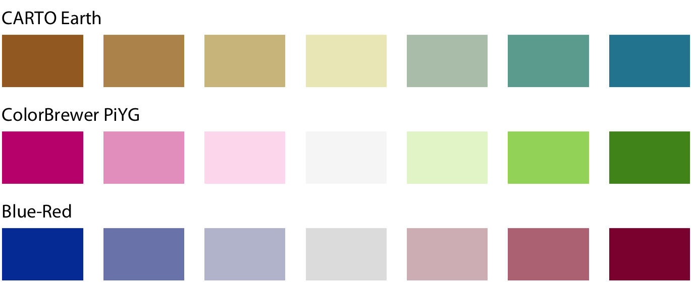

layout: true

```{r setup, include=FALSE}
options(htmltools.dir.version = FALSE)
knitr::opts_chunk$set(
  eval = TRUE,
  message = FALSE,
  echo = TRUE,
  warnings = FALSE,
  fig.align = "center"
)
```

```{r, eval=TRUE, echo=FALSE}
xaringanExtra::use_webcam()
```

---

# Goals

- understand what the purposes of data visualizations are
- start to think visually, for obtaining intuitive plots for scientific presentations and publications
- learn dos and donts of plotting

### Prerequisites

- some familiarity with data, in general

--

## Practical session? (not today)

**Aims:**

- familiarize with plotting in R using base graphics and ggplot2, to rapidly and flexibly explore datasets by visualization
- learn how to visualize data along 1, 2, or more dimensions
- learn some options about interactive visualizations
- required: basic understanding of R

---

# What's data visualization?

--

**Data visualization** is...

--

part **art** and part **science**. 

**Challenge**: get the art right without getting the science wrong (and vice versa) 

--

- A data visualization first and foremost has to **accurately convey the data** - It must not mislead or distort. 
- A data visualization should be **aesthetically pleasing**. Good visual presentations tend to enhance the message of the visualization. 

--

Whenever we visualize data, we take data values and convert them in a systematic and logical way into the visual elements that make up the final graphic. 

All data visualizations map data values into quantifiable features of the resulting graphic (_aesthetics_).

You'll have to be scientist *and* designer!

---

# Why visualization?

<!-- Data visualisation generally communicates information much quicker than numerical tables. -->
<!-- Data visualisation can also reveal unexpected structures in data; it is not surprising that data visualisation is one of the key tools in exploratory data analysis. -->
<!-- Data plot is usually more eye-catching even if you lose accuracy of the information. -->

We want to...

--

- communicate
- deliver summaries
- display patterns
  - in a compact way
  - in a meaningful way
  
--

Is visualization that important?

--

.huge[Yes.]

--

Think of what you look first in a paper.  
BTW: what do you look first in a paper?

--

And yet, we will just be scratching the surface!

---

# Got a nice viz?

Think of/search/link/describe a nice visualization example you encountered, and let's start a discussion together

--> Post the link in the chat and we can discuss about it in the discussion
---

# There is no "one plot to seize them all"

Key for any data visualization: make sure that it is appropriate to your data type (e.g. discrete vs continuous), and fits your purpose, i.e. what you are trying to communicate!


Looking for inspiration?
You can visit the R Graph Gallery, a fantastic resource for ggplot2 code and inspiration! 

https://www.r-graph-gallery.com/

---

# What a time to be alive...

--

<blockquote class="twitter-tweet"><p lang="de" dir="ltr">1987&#39;s Micrografx Windows Graph designed for Microsoft Windows 1<a href="https://t.co/gznEQwmoOA">https://t.co/gznEQwmoOA</a> <a href="https://t.co/vsfiwaVkhj">pic.twitter.com/vsfiwaVkhj</a></p>&mdash; RJ Andrews (@infowetrust) <a href="https://twitter.com/infowetrust/status/1529581558583422977?ref_src=twsrc%5Etfw">May 25, 2022</a></blockquote> <script async src="https://platform.twitter.com/widgets.js" charset="utf-8"></script> 

---

# Visualizations

A compendium - and some kind of lexicon as well

Following the beautiful https://clauswilke.com/dataviz/ book

---

# Talking about color first

--


--

**Qualitative scale**: distinguish things

---

# Talking about color first

    

--

**Sequential scale**: Representing data values

---

# Talking about color first



--

**Sequential scale, diverging**: midpoint matters.

Can you name an example for a meaningful midpoint?

--

Who of you has seen a heatmap for microarrays? Why are many bad?

---

# Visualizations - Amounts

--


We are interested in the magnitude of some set of numbers

---

# Visualizations - Amounts


--

We are interested in the magnitude of some set of numbers, **varying according to two categorical variables**

---

# Visualizations - Distributions


--

We would like to understand how a particular variable is distributed in a dataset

---

# Visualizations - Distributions


--

With multiple distributions we would like to visualize simultaneously...

---

# Visualizations - Proportions


--

We want to show how some group, entity, or amount breaks down into individual pieces that each represent a proportion of the whole

Disclaimer: yes, I do hate pie charts

---

# Visualizations - Proportions


--

When visualizing multiple sets of proportions or changes in proportions across conditions

---

# Visualizations - Proportions


--

When proportions are specified according to multiple grouping variables

---

# Visualizations - Associations


--

When we want to show one quantitative variable relative to another 

---

# Visualizations - Associations


--

With large number of points...

---

# Visualizations - Associations


--

When the time component comes somehow into play...

---

# Visualizations - Uncertainty


--

Error bars are meant to indicate the range of likely values for some estimate or measurement

---

# Visualizations - Uncertainty


--

Some more detailed representations

---

# Visualizations - Uncertainty


Some more detailed representations

---

# A primary principle - show me your data!

--

FOR REAL.

--

<p align="center">

</p>

--

This is what is also called "dynamite plot". Can you name why these are bad?

--

Can you tell me why people keep on using them? How can we improve this?

---

# A primary principle - show me your data!

FOR REAL.


---

# A primary principle - show me your data!

FOR REAL.


Check out Statistical relevance—relevant statistics, part I & part II by Bernd Klaus

https://simplystatistics.org/2019/02/21/dynamite-plots-must-die/

---

# Is this a good plot?

<p align="center">

</p>

---

# Some other principles 

**Proportional ink**

--

The sizes of shaded areas in a visualization need to be proportional to the data values they represent

--

**Handling overlapping points**

--

Partial transparency and jittering; or using small multiples/faceting

--

**Color might be bad**

--

... when it is too much, poorly chosen (rainbow for quantities anyone?), or not accounting for vision deficiency (check out the work of Okabe and Ito!)

--

**Compound figures**

--

Do not confound the reader! Use consistent encoding, match orderings e.g. in plots AND legend

---

# Some other principles 

**Titles, captions, and tables**

--

Just. Provide. Appropriate. Context. 

Often readers just skim through your paper.

--

**Don’t go 3D**

--

Just don't. When gratuitous, just do not do it. Well, unless you are representing something which _is_ 3-dimensional (topographic reliefs, or protein structures)

---

# Got a nice viz?

Let's try to dissect that

---

# Let's create some visualizations

<!-- TODO: using fabricerin to draw in the slides?! -->

```{r echo = FALSE}
library(fabricerin)
fabricerin::fabric_drawing(cid = "bad_good", cwidth = 1000, cheight = 700)
```

---

# An appetizer for RNA-seq?

...or many other high-dimensional data

* MA plot
* volcano plot
* heatmaps
* PCA plot
* t-SNE/UMAP plot
* other genomic data (karyoplots, ...)

---

# An appetizer for RNA-seq?

```{r, echo=FALSE,message=FALSE, warning=FALSE}
library("Hiiragi2013")
data("x")
library("pheatmap")
library("dplyr")
groups <- group_by(pData(x), sampleGroup) %>%
  summarise(n = n(), color = unique(sampleColour))
groupColor <- setNames(groups$color, groups$sampleGroup)
topGenes <- order(rowVars(Biobase::exprs(x)), decreasing = TRUE)[1:500]
rowCenter <- function(x) { x - rowMeans(x) }
pheatmap( rowCenter(Biobase::exprs(x)[ topGenes, ] ),
  show_rownames = FALSE, show_colnames = FALSE,
  breaks = seq(-5, +5, length = 101),
  annotation_col =
    pData(x)[, c("sampleGroup", "genotype", "Embryonic.day", "ScanDate") ],
  annotation_colors = list(
    sampleGroup = groupColor,
    genotype = c(`FGF4-KO` = "chocolate1", `WT` = "azure2"),
    Embryonic.day = setNames(brewer.pal(9, "Blues")[c(3, 6, 9)],
                             c("E3.25", "E3.5", "E4.5")),
    ScanDate = setNames(brewer.pal(nlevels(x$ScanDate), "YlGn"),
                        levels(x$ScanDate))
  ),
  cutree_rows = 4
)
```


---

# A helpful checklist

* **Appropriate plot type for results** - Might be a boxplot, a scatterplot, a linear regression fit ... many options

--

* **Plot is well organised** -	The independent (explanatory) variable is on the x and the dependent (response) variable is on the y axis

--

* **X and Y axes use correct units** - Having proper symbols (for alpha, beta, etc.) and super/subscript where needed

--

* **X and Y axes easy to read** - Beware awkward fonts and tiny letters

--

* **Clear informative legend** - It's easy to tell apart what points/lines on the graph represent

---

# A helpful checklist

* **Plot is not cluttered** - Don't put all results on one plot, give them space to shine

--

* **Clear and consistent colour scheme** - Stick with the same colours for the same variables, avoid red/green combinations which might look the same to colourblind people

--

* **Plot in the right dimensions** - Avoid overlapping labels and points/lines which merge together and make your graph longer/wider if needed

--

* **Measures of uncertainty where appropriate** - Error bars, confidence and credible intervals, remember to say in the caption what they are

--

* **Concise and informative caption** - Remember to include what the data points show (raw data? Model predictions?), what is the sample size for each treatment, the effect size and what measure of uncertainty accompanies it

<!-- --- -->

<!-- # Choosing the right visualization software -->

<!-- Reproducibility and repeatability -->
<!-- Data exploration versus data presentation -->
<!-- Separation of content and design -->

<!-- --- -->

<!-- # Telling a story and making a point -->

<!-- Most data visualization is done for the purpose of communication. We have an insight about a dataset, and we have a potential audience, and we would like to convey our insight to our audience. To communicate our insight successfully, we will have to present the audience with a clear and exciting story. The need for a story may seem disturbing to scientists and engineers, who may equate it with making things up, putting a spin on things, or overselling results. However, this perspective misses the important role that stories play in reasoning and memory. -->

<!-- What is a story? -->

<!-- Before we can discuss strategies for turning visualizations into stories, we need to understand what a story actually is. A story is a set of observations, facts, or events, true or invented, that are presented in a specific order such that they create an emotional reaction in the audience. The emotional reaction is created through the build-up of tension at the beginning of the story followed by some type of resolution towards the end of the story. We refer to the flow from tension to resolution also as the story arc, and every good story has a clear, identifiable arc. -->

<!-- Never assume your audience can rapidly process complex visual displays.  -->

<!-- do everything we can to help our readers understand the meaning of our visualizations and see the same patterns in the data that we see. This usually means less is more. Simplify your figures as much as possible. -->


---

# Summary

**Visualizing data** is one of the most important activities in applied statistics & in science. 

--

There is a large number of **good (and bad) practices** -> you can quickly see whether a certain graphic is effective in conveying its message

--

Important **options**: 

- plot type (what is called a geom in `ggplot2`)
- proportions (incl. aspect ratios) 
- colors. 

--

The **grammar of graphics** is a powerful set of concepts to reason about graphics and to communicate our intentions for a data visualization to a computer.

--

Creating your own visualizations is in many ways like good writing. It is extremely important, but **there is no simple recipe** for it. 

--

**Look carefully** at lots of visualizations made by others & experiment with making your own visualizations to learn the ropes.

--

*Yes, we just scratched the surface!* Data viz is a scientific discipline in its own

---

# Resources

Some of these are full books, some of them are even fully free and available online; all are accessible and very useful!

- https://rstudio.com/resources/cheatsheets/
- Claus Wilke's book https://clauswilke.com/dataviz/
- Tamara Munzner's work
- Huber & Holmes: https://www.huber.embl.de/msmb/Chap-Graphics.html
- all the links from https://clauswilke.com/dataviz/bibliography.html
- Statistical relevance—relevant statistics, part I & part II (Klaus, EMBO Journal)

---

class: center, middle

## ... thank you for your attention!
<code>marinif@uni-mainz.de</code> - `r icons::fontawesome('twitter')` [`@FedeBioinfo`](https://twitter.com/FedeBioinfo)

---

<!-- empty slide -->
